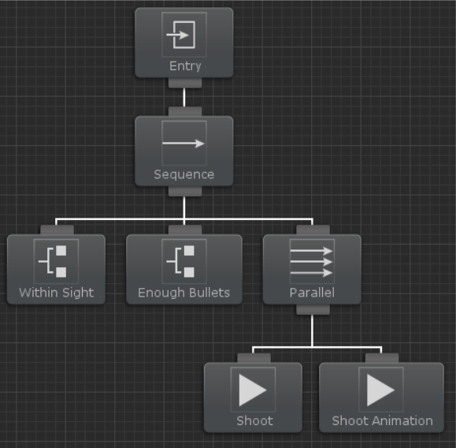

# 비헤이비어 디자이너

## 개요

비헤이비어 디자이너(Behavior Designer)는 프로그래머, 아티스트, 디자이너 등 모두를 위해 설계된 비헤이비어 트리(Behavior Tree, 행동 트리) 구현입니다. 비헤이비어 디자이너는 새로운 작업을 쉽게 생성할 수 있는 강력한 API를 제공합니다. 광범위한 써드 파티 통합이 포함된 직관적인 비주얼 에디터를 제공하여 코드를 한줄도 작성하지 않고도 복잡한 AI를 생성할 수 있습니다.

이 가이드는 비헤이비어 디자이너의 모든 측면에 대한 일반적인 개요를 제공합니다. ["Behavior Tree Basics"](https://www.youtube.com/watch?v=PuLuwzgYB4g&list=PLCPL5IYZm1NLVVxJx3-CFTLuHvLbCgmzk&index=2) 비디오 시리즈를 통해서 비헤이비어 트리에 대한 공부를 시작할 수 있습니다. 이 페이지에는 비헤이비어 트리에 대한 간략한 [개요](https://opsive.com/support/documentation/behavior-designer/what-is-a-behavior-tree/)도 있습니다. 비헤이비어 디자이너를 사용하면 기본 비헤이비어 트리 구현을 알 필요가 없지만 작업 유형(Action, Composite, Condition 및 Decorator)과 같은 몇 가지 주요 개념을 아는 것이 좋습니다.

비헤이비어 디자이너를 처음 열면 다음과 같은 창이 표시됩니다:


비헤이비어 디자이너에는 4개의 섹션이 존재합니다. 

아래 스크린샷에서 섹션 1은 그래프 영역(graph area)입니다. 여기에서 비헤이비어 트리를 생성할 것입니다. 

섹션 2는 속성(Properties) 패널입니다. 속성 패널은 비헤이비어 트리의 특정 속성을 편집하거나, 새 태스크(tasks)을 추가하거나, 새 변수(variables)를 생성하거나, 태스크의 매개변수(parameters)를 편집하는 곳입니다. 

섹션 3은 비헤이비어 트리 작업 도구 모음입니다. 드롭다운 상자를 사용하여 기존 비헤이비어 트리를 선택하거나 비헤이비어 트리를 추가/제거할 수 있습니다.

마지막 섹션인 섹션 4는 디버그 도구 모음입니다. 이 패널 내에서 유니티를 start/stop, step 및 pause를 할 수 있습니다.또한 트리 실행을 시작하기 전에도 트리에 발행한 오류 수를 확인할 수 있습니다.


섹션 1은 작업을 진행할 비헤이비어 디자이너의 주요 부분입니다. 이 섹션에 새 태스크를 만들고 그 태스크를 비헤이비어 트리에 붙일 수 있습니다. 작업을 시작하려면 먼저 비헤이비어 트리 구성 요소를 추가해야 합니다 비헤이비어 트리 구성 요소는 이제 막 생성하기 시작한 비헤이비어 트리의 관리자 역할을 합니다. 그래프 영역 내에서 마우스 우클릭 하고 "Add Behavior Tree(비헤이비어 트리 추가)"를 클릭하거나 섹션 3의 작업 영역 내에서 "Lock(잠금)" 옆에 있는 더하기 버튼을 클릭하여 새 비헤이비어 트리 구성 요소를 생성할 수 있습니다.

 

비헤이비어 트리가 추가되면 태스크 추가를 시작할 수 있습니다. 그래프 영역 내에서 마우스를 우클릭하거나 속성 패널의 섹션 2에서 "태스크" 탭을 클릭하여 태스크를 추가합니다. 스페이스 바를 누르고 빠른 작업 검색창을 열어 새 태스크를 추가할 수도 있습니다:


태스크가 추가되면 아래와 같이 표시됩니다:


추가한 태스크 외에도 엔트리 태스크(Entry Task)도 추가됩니다. 엔트리 태스크는 트리의 루트 역할을 합니다. 그것이 엔트리 태스크의 유일한 목적입니다. 하위 항목이 없기 때문에 시퀀스 태스크(Sequence Tasks)에 오류가 있습니다. 하위 태스크를 추가하면 오류가 사라집니다. 이제 첫 번째 태스크를 추가했으므로 몇 가지를 더 추가할 수 있습니다:


시퀀스 태스크 아래 쪽에서 셀렉터 태스크(Selector Tasks, 선택기 태스크)의 위쪽으로 끌어 시퀀스와 셀렉터 태스크를 연결할 수 있습니다. 나머지 태스크에 대해 이 프로세스를 반복합니다. 실수를 했다면 연결을 선택하고 Delete 키로 삭제할 수 있습니다. 태스크를 클릭하고 드래그해서 태스크를 재정렬할 수도 있습니다.

비헤이비어 디자이너는 깊이 우선 순위로 작업을 실행합니다. 각 태스크를 왼쪽 오른쪽으로 드래그하여 작업의 실행 순서를 변경할 수 있습니다. 위의 스크린샷에서 작업은 다음 순서로 실행됩니다:

```
SequenceA → SelectorA → SequenceB → ActionA → ActionB → ActionC →SelectorB → ActionD → ActionE
```


이제 기본 비헤이비어 트리가 생성되었으므로 태스크 중 하나의 매개변수를 수정할 수 있습니다. ActionC 노드를 선택하여 속성 패널 내에서 인스펙터를 불러옵니다. 여기서 태스크 이름을 바꾸거나 대스크를 인스턴트로 설정하거나 태스크의 설명을 입력할 수 있음을 볼 수 있습니다. 또한 태스크 클래스에 포함된 모든 공용 변수를 수정할 수 있습니다. 여기에는 비헤이비어 디자이너 내에서 생성된 변수 할당이 포함됩니다. 이 경우에 유일한 공개 변수는 `RotationSpeed`입니다. 매개변수를 설정한 값은 비헤이비어 트리 내애서 사용됩니다.

속성 패널에는 변수, 태스크 및 비헤이비어(Behavior, 동작)의 세 가지 다른 탭이 있습니다. 

변수 패널을 사용하면 태스크 간에 공유되는 변수를 만들 수 있습니다. 자세한 내용은 [변수 토픽](https://opsive.com/support/documentation/behavior-designer/variables/)을 참조하십시오.

태스크 패널에서는 사용할 수 있는 모든 태스크가 나열됩니다. 이것은 마우스 우클릭하고 태스크를 추가할 때 보여지는 것과 동일한 목록입니다. 이 목록은 태스크, 컴포지트(Composite), 컨디셔널(Conditional, 조건부), 데코레이터 태스크(Decorator Task) 타입에서 파생된 클래스를 검색하여 생성됩니다.

마지막 패널인 비헤이비어 패널에는 비헤이비어 트리를 처음 만들 때 추가한 비헤이비어 트리 구성 요소에 대한 관리자가 표시됩니다. 각 옵션이 수행하는 작업에 대한 자세한 내용은 [비헤이비어 구성요소 개요 페이지](https://opsive.com/support/documentation/behavior-designer/behavior-tree-component/)에 있습니다.


비헤이비어 디자이너 창의 마지막 섹션은 작업 도구 모음입니다. 작업 도구 모음은 주로 비헤이비어 트리를 선택하고 비헤이비어 트리를 추가/제거하는 데 사용됩니다. 각 번호는 다음 작업과 연결됩니다:

1. 열려있는 비헤이비어 트리 사이를 앞뒤로 탐색합니다.
2. 씬 또는 프로젝트(프리팹 포함) 내에 있는 모든 비헤이비어 트리를 나열합니다.
3. 비헤이비어 트리 구성 요소가 추가된 씬 내의 모든 게임오브젝트를 나열합니다.
4. 3번에서 선택한 게임오브젝트에 연결된 모든 비헤이비어 트리를 나열합니다.
5. 현재 비헤이비어 트리가 참조하는 모든 외부 비헤이비어 트리를 나열합니다.
6. 현재 선택한 비헤이비어 트리를 제거합니다.
7. 게임오브젝트에 새 비헤이비어 트리를 추가합니다.
8. 하이어라키 뷰 또는 프로젝트 뷰 내에서 다른 게임 오브젝트를 선택한 경우에도 현재 비헤이비어 트리를 활성 상태로 유지합니다.
9. 비헤이비어 트리를 외부 비헤이비어트리 에셋으로 내보냅니다.
10. 비헤이비어 트리를 검색할 수 있는 검색 대화 상자를 엽니다.
11. 현재 비헤이비어 트리의 스크린샷을 만듭니다.
12. 비헤이비어 디자이너 기본 설정을 표시합니다.

### 비헤이비어 트리란?

비헤이비어 트리는 많은 게임에서 널리 사용되는 AI 테크닉입니다. 헤일로2는 비헤이비어 트리를 사용한 최초의 메인스트림급 게임이었으며 헤일로 2에서 사용된 방법에 대한 [자세한 설명](https://www.gamedeveloper.com/programming/gdc-2005-proceeding-handling-complexity-in-the-i-halo-2-i-ai)이 공개된 이후에 더 유명해지기 시작했습니다. 비헤이비어 트리는 계층적 상태 머신, 스케줄링, 계획 및 작업 실행과 같은 다양한 AI 테크닉들의 조합입니다. 이 비헤이비어 트리의 주요 장점 중 하나는 이해하기 쉽고 시각적 편집기를 사용하여 만들 수 있다는 것입니다.



가장 단순한 수준에서 비헤이비어 트리는 태스크들의 모음입니다. 태스크는 액션(Action), 컨디셔널(Conditional), 컴포지트(Composite), 데코레이터(Decorator)의 네 가지 유형으로 나누어집니다.

액션 태스크는 어떠한 방식으로는 게임의 상태를 변경한다는 점에서 가장 이해하기 쉬운 태스크입니다.

컨디셔널 태스크는 게임의 일부 프로퍼티를 테스트합니다. 예를 들어 위 이미지에서 보여지는 비헤이비어 트리에서 AI 에이전트에는 두 개의 컨디셔널 태스크와 두 개의 액션 태스크가 있습니다. 처음 두 개의 컨디셔널 태스크는 에이전트의 시야에 적이 있는지 확인한 다음 에이전트가 무기를 발사하기에 충분한 총알이 있는지 확인합니다. 이 두 조건이 모두 참(true)이면 두 가지 액션 태스크가 실행됩니다. 액션 태스크 중 하나는 무기를 쏘고 다른 태스크는 사격 애니메이션을 실행합니다. 비헤이비어 트리의 진정한 힘은 다른 하위 트리를 생성할 때 발휘됩니다. 두 가지 사격 액션이 하나의 하위 트리를 형성할 수 있습니다. 이전 컨디셔널 태스크 중 하나가 실패하면 적으로부터 도망치는 것과 같은 다른 일련의 액션 태스크를 수행하는 다른 하위 트리가 만들어질 수 있습니다. 상위 수준의 비헤이비어 트리를 형성하기 위해 하위 트리를 서로 그룹화 할 수 있습니다.

컴포지트 태스크는 하위 태스크 목록을 포함하는 상위 태스크입니다. 위의 예시에서 컴포지트 태스크는 시퀀스(Sequence, 순서) 및 패러렐(Parallel, 병렬)로 레이블이 지정됩니다. 시퀀스 태스크는 모든 작업이 실행될 때까지 각 작업을 한 번씩 실행합니다. 적이 시야 내에 있으면 에이전트가 총알이 남아있는지 확인하는 컨디셔널 태스크를 실행합니다. 그리고 에이전트에 총알이 충분하면 무기를 쏘고 사격 에니메이션을 재생하는 패러렐 태스크가 실행됩니다. 시퀀스 태스크가 한 번에 하나의 하위 태스크를 실행한다면, 패러렐 태스크는 모든 하위 태스크를 동시에 실행합니다.

마지막 태스크 타입은 데코레이터 태스크입니다. 데코레이터 태스크는 하나의 하위 태스크만 가질 수 있는 상위 태스크입니다. 이 데코레이터 태스크의 기능은 어떤 식으로든 하위 태스크의 동작을 수정하는 것입니다. 위의 예에서 우리는 데코레이터 태스크를 사용하지 않았지만 어떤 태스크가 완료되기 전에 실행중인 것을 중지하려는 경우(인터럽트 태스크(Interrupt task)라고 부름) 데코레이터 태스크를 사용할 수 있습니다. 예를 들어 에이전트가 자원 수집과 같은 태스크를 수행할 수 있습니다. 그때 적이 근처에 있으면 리소스 수집을 중지하는 인터럽트 태스크가 있을 수 있습니다. 데코레이터 태스크의 또 다른 예는 하위 태스크를 N회만큼 다시 실행하거나 성공적으로 완료될 때까지 하위 태스크를 계속 실행하는 데코레이터 태스크입니다.

지금까지 생략한 주요 비헤이비어 트리 토픽 중 하나는 태스크의 반환 상태입니다. 완료하는 데 1프레임보다 많은 시간이 걸리는 태스크가 있을 수 있습니다. 예를 들어 대부분의 애니메이션은 한 프레임 내에서 시작하고 끝나지 않습니다. 또한 컨디셔널 태스크는 상위 태스크가 해당 하위 태스크를 계속 실행해야 하는지 여부를 결정할 수 있도록 조건이 참인지 여부를 상위 태스크에 알리는 방법이 필요합니다. 이러한 무제는 모두 태스크 상태(Task status)를 사용하여 해결할 수 있습니다. 태스크를 실행, 성공 또는 실패의 세 가지 상태 중 하나에 있습니다. 첫 번째 예에서 사격 애니메이션 태스크는 사격 애니메이션이 재생되는 동안 실행 중인 태스크 상태를 갖습니다. 적이 시야 내에 있는 확인하는 컨디셔널 태스크는 한 프레임 내에 성공 또는 실패를 반환합니다.

비헤이비어 디자이너는 이러한 모든 개념을 유니티의 모노비헤이비어 API(MonoBehaviour API)와 유사한 API로 사용하기 쉬운 인터페이스로 패키징합니다. 비헤이비어 디자이너는 표준 설치(Standard Installation)에 많은 컴포지트 및 데코레이터 클래스를 포함합니다. 액션 및 컨디셔널 태스크는 게임에 따라 다르기 때문에 이러한 태스크가 만히 포함되지는 않지만 [샘플 프로젝트](https://opsive.com/downloads/?pid=803)에는 많은 예시가 있습니다. [태스크 유형 중 하나를 확장](https://opsive.com/support/documentation/behavior-designer/writing-a-new-conditional-task/)하여 새 태스크를 만들 수 있습니다. 또한 비헤이비어 디자이너를 최대한 쉽게 배울 수 있도록 많은 [동영상](https://opsive.com/support/documentation/behavior-designer/videos/)을 제작했습니다.

### 비헤이비어 트리 혹은 유한 상태 머신(FSM, Finite State Machines)

어떤 상황에서 유한 상태 머신(예를 들어 플레이메이커)에 대해 비헤이비어 트리를 사용해야 할까요? 가장 높은 수준에서 비헤이비어 트리는 AI에 사용되는 반명에 FSM(유한 상태 머신)은 보다 일반적인 시각적 프로그래밍(general visual programming)에 사용됩니다. 일반적인 시각적 프로그래밍에 비헤이비어 트리를 사용하고 AI에 유한 상태 머신을 사용할 수도 있지만 각 도구가 그렇게 하도록 설계되지는 않았습니다. 일부의 개발자들은 유한 상태 머신의 시대는 끝났다고 이야기 하지만, 우리는 그렇게 까지는 멀리 가지 않을 것입니다. 그래도 비헤이비어 트리는 AI와 관련하여 유한 상태 머신보다 확실히 이점이 있습니다.

비헤이비어 트리는 FSM에 비해서 굉장히 유연하고 강력하며 쉽게 변경할 수 있습니다.

첫 번째 이점인 유연성을 먼저 살펴보겠습니다. FSM을 사용하여 한 번에 두 개의 다른 상태를 실행하는 방법에는 어떤 것이 있을까요? 유일한 방법은 두 개의 개별 FSM을 만드는 것입니다. 하지만 비헤이비어 트리에서는 패러렐 태스크를 추가하기만 하면 됩니다. 비헤이비어 디자이너를 사용하면 해당 하위 태스크가 플레이메이커 FSM이 될수 있으며 해당 FSM은 병렬로 실행됩니다.

유연성의 또 다른 예시로는 태스크 가드 태스크(task guard task, 태스크 방지 태스크)입니다. 이 예시에서는 사운드 효과를 재생하는 두개의 다른 태스크가 있습니다. 이 두 개의 다른 태스크는 비헤이비어 트리의 두 가지 다른 분기에 있으므로 서로에 대해 알지 못하고 잠재적으로 동시에 음향 효과를 재생할 수 있습니다. 하지만 두 개의 다른 음향이 동시에 재생되면 보통은 불쾌한 소리가 나기 때문에 이런 일은 일어나지 않는게 좋습니다. 이 상황에서 세마포어 태스크(Semaphore task)(비헤이비어 디자이너에서 태스크 가드(Task guard)라고 함)를 추가할 수 있으며 한 번에 하나의 사운드 효과만 재생하도록 할 수 있습니다. 이렇게 하므로써 첫 번째 사운드 재생이 끝나면 두 번째 사운드가 재생되기 시작합니다.

비헤이비어 트리의 또 다른 장점은 강력함입니다. 물론 이 말의 뜻은 FSM이 빈약하다는 것이 아니라 비헤이비터 트리가 다양한 면에 강력하다는 이야기 입니다. 비헤이비어 트리를 사용하면 AI가 유한 상태 머신보다 더 쉽게 현재 게임 상태에 반응할 수 있습니다. 모든 종류의 상황에 반응하는 AI를 만들기 위해서 FSM을 사용하면 수많은 스테이트와 트랜지션이 필요하기 때문에 [스파게티처럼 엄청나게 꼬인 상태 머신](https://answers.unrealengine.com/storage/temp/23368-statemachinespaghetti.png)을 만들게 됩니다. 하지만 비헤이비어 트리를 사용하면 그보다 훨씬 쉽게 만들 수 있습니다.

비헤이비어 트리의 마지막 장점 중 하나는 변경하기가 정말 쉽다는 것입니다. 비헤이비어 트리가 인기를 얻은 이유 중 하나는 비주얼 편집기로 쉽게 만들 수 있기 때문입니다. FSM으로 스테이트 실행 순서를 변경하려면 스테이트 사이의 트랜지션을 변경해야 합니다. 비헤이비어 트리를 사용하면 태스크를 드해그하기만 하면 됩니다. 트랜지션에 대해 걱정할 필요가 없습니다. 또한 태스크를 변경하거나 태스크 분기에 새 상위 태스크를 추가하는 것 만으로 AI가 다양한 상황에 반응하는 방식을 쉽고도 완전하게 바꿀 수 있습니다.

비헤이비어 트리와 FSM이 상호배타적일 필요는 없습니다. FSM이 기능을 정의하는 동안 비헤이비어 트리는 AI의 흐름을 정의할 수 있습니다. 이 조합은 FSM의 기능을 유지하면서 비헤이비어 트리의 기능을 제공합니다.