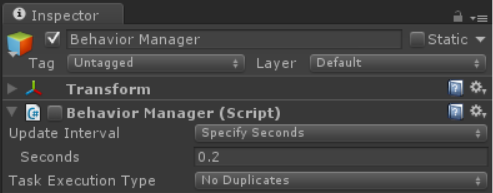
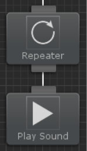

# 비헤이비어 매니저



비헤이비어 트리가 실행될 때 아직 비헤이비어 매니저가 생성되지 않은 경우 비헤이비어 매니저 컴포넌트가 부착된 새 게임오브젝트를 생성합니다. 이 컴포넌트는 씬에 존재하는 모든 비헤이비어 트리의 실행을 관리합니다.

Update Interval 프로퍼티를 변경하여 비헤이비어 트리가 틱(Tick)하는 빈도를 제어할 수 있습니다. "Every Frame"은 업데이트 루프 내의 모든 프레임에서 비헤이비어 트리를 틱시킵니다. "Specify Seconds"를 사용하면 주어진 시간(초)마다 비헤이비어 트리를 틱시킵니다. 마지막 옵션은"Manual"로 비헤이비어 트리를 체크할 시점을 제어할 수 있습니다. Tick 함수를 호출하여 비헤이비어트리를 틱시킬 수 있습니다:

```csharp
BehaviorManager.instance.Tick();
```

또한 특정한 비헤이비어 트리를 매개변수로 하여 해당 비헤이비어 트리를 수동으로 틱할 수 있습니다:

```csharp
BehaviorManager.instance.Tick(BehaviorTree);
```

태스크 실행 타입(Task Excution Type)을 사용하면 비헤이비어 트리가 해당 틱 동안 이미 실행된 태스크에 도달할 때까지 태스크를 계속 실행해야 하는지 또는 해당 틱 동안 최대 태스크 수가 실행될 때까지 작업을 계속 실행해야하는지를 지정할 수 있습니다. 다음과 같은 비헤이비어 트리를 예시로 들 수 있습니다:



위 이미지에서 리피터(Repeater) 태스크는 5회 반복하도록 설정되어 있다고 가정해보겠습니다. 이 비헤이비어 트리의 태스크 실행 타입이 중복 없음(No Duplicates)으로 설정되어 있다면 사운드 재생 작업은 단일 틱 동안 한 번만 실행됩니다. 하지만 태스크 실행 타입을 Count로 설정하면 최대 태스크 실행 횟수를 지정할 수 있습니다. 여기서 값을 5로 지정하면 사운드 재생 작업이 단일 틱에서 5번 모두 실행됩니다.