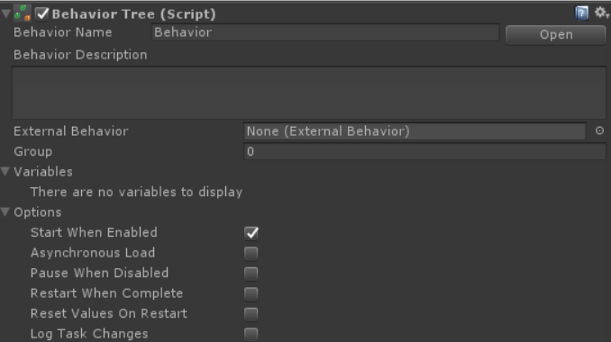

# 비헤이비어 트리 컴포넌트



비헤이비어 트리 컴포넌트는 비헤이비어 트리를 저장하고 비헤이비어 디자이너와 태스크 사이의 인터페이스 역할을 합니다. 다음 API는 비헤이비어 트리를 시작 및 중지하기 위해 노출됩니다:

```csharp
public void EnableBehavior();

// pause:  현재 실행에서 비헤이비어 트리를 일시적으로 중지합니다. 
// EnableBehavior를 사용하여 재시작할 수 있습니다.
public void DisableBehavior(bool pause = false);
```

다음 방법 중 하나를 사용하여 태스크를 찾을 수 있습니다:

```csharp
TaskType FindTask<TaskType>();
List<TaskType> FindTasks<TaskType>();
Task FindTaskWithName(string taskName);
List<Task> FindTasksWithName(string taskName);
```

트리의 현재 실행 상태는 다음을 호출하여 얻을 수 있습니다:

```csharp
behaviorTree.ExecutionStatus
```

트리가 실행 중이면 Running 상태가 반환됩니다. 트리가 완료되면 태스크 결과에 따라 실행 상태가 성공 또는 실패가 됩니다.

다음 이벤트도 구독할 수 있습니다:

```csharp
OnBehaviorStart
OnBehaviorRestart
OnBehaviorEnd
```

비헤이비어 트리 컴포넌트에는 다음과 같은 프로퍼티가 있습니다:

**Behavior Name**

비헤이비어 트리의 이름

**Behavior Description**

비헤이비어 트리가 하는 일을 설명합니다.

**External Behavior**

이 비헤이비어 트리가 시작될 때 실행되어야 하는 외부 비헤이비어 트리를 지정하는 필드입니다.

**Group**

비헤이비어 트리의 숫자 그룹화. 비헤이비어 트리를 쉽게 찾는데 사용할 수 있습니다. CTF 샘플 프로젝트는 이에 대한 예를 보여줍니다.

**Start When Enabled**

true인 경우 컴포넌트가 활성화될 때 비헤이비어 트리가 실행되기 시작합니다.

**Asynchronous Load**

비헤이비어 트리를 별도의 스레드에서 로드해야 하는지 여부를 지정합니다. Unity는 작업자 스레드에서 API 호출을 허용하지 않으므로 [공유 변수](https://opsive.com/support/documentation/behavior-designer/variables/)에 대한 프로퍼티 매핑을 사용하는 경우 이 옵션을 비활성화해야 합니다.

**Pause When Disabled**

true인 경우 컴포넌트가 비활성화될 때 비헤이비어 트리가 일시중지됩니다. false이면 비헤이비어 트리가 종료됩니다.

**Restart When Complete**

true인 경우 실행이 완료되면 비헤이비어 트리가 처음부터 다시 시작됩니다. false이면 비헤이비어 트리가 종료됩니다.

**Reset Values On Restart**

true인 경우 트리가 다시 시작될 때 변수 및 태스크 공용 변수가 원래 값으로 재설정됩니다.

**Log Task Changes**

디버깅에 사용됩니다. 활성화된 경우 비헤이비어 트리는 시작 또는 중지와 같이 태스크 상태가 변경될 때마다 출력합니다.

## 스크립트에서 비헤이비어 트리 생성하기

어떤 상황에서는 비헤이비어 트리를 포함하기 위해 프리팹에 직접 붙이는 대신 스크립트에서 비헤이비어 트리를 생성할 수 있습니다. 예를 들어 외부 비헤이비어 트리를 저장하고 새로 생성된 비헤이비어 트리에서 해당 트리를 로드하려고 할 수 있습니다. 이것은 비헤이비어 트리 컴포넌트에서 `externalBehavior` 변수를 설정하는 것으로 가능합니다:

``` csharp
using UnityEngine;
using BehaviorDesigner.Runtime;

public class CreateTree : MonoBehaviour
{
        public ExternalBehaviorTree behaviorTree;
        private void Start()
        {
                var bt = gameObject.AddComponent<BehaviorTree>();
                bt.StartWhenEnabled = false;
                bt.ExternalBehavior = behaviorTree;
        }
}
```

위 예시에서 공개 변수 `behaviorTree`는 외부 비헤이비어 트리에 대한 참조를 포함합니다. 새로 생성된 트리가 로드되면 모든 태스크에 대한 외부 비헤이비어 트리가 로드됩니다. 트리가 즉시 실행되는 것을 방지하기 위해 `StartWhenEnabled`를 false로 설정합니다. 그런 다음 `bt.EnableBehavior()` 함수를 사용하여 트리를 수동으로 시작할 수 있습니다.