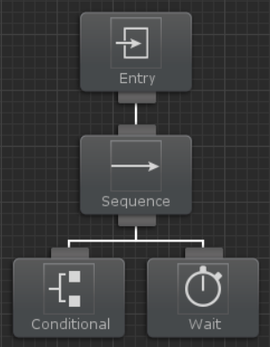
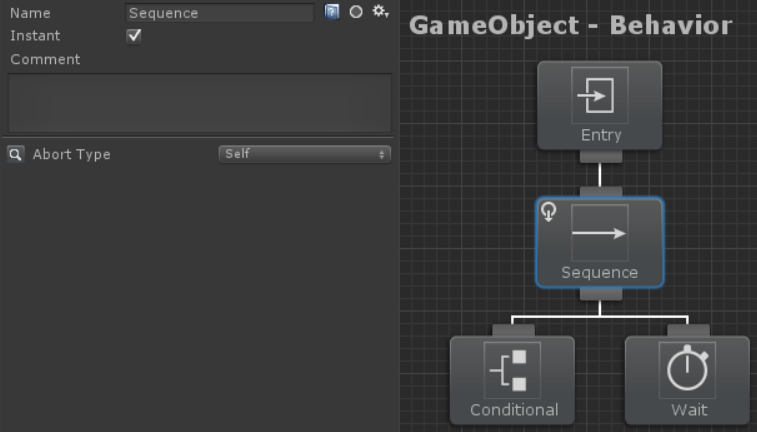
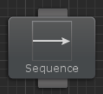
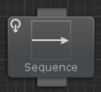
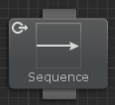
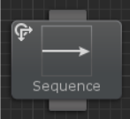
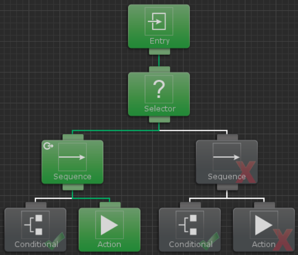
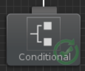
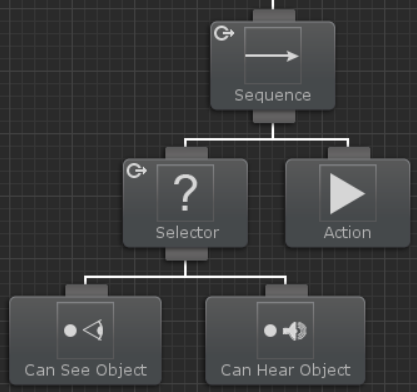

# 조건부 중단(Conditional Abort)

조건부 중단을 사용하면 많은 Interrupt/Perform Interrupt 태스크로 비헤이비어 트리를 복잡하게 만들지 않고도 비헤이비어 트리가 변경 사항에 동적으로 응답할 수 있습니다. 이 기능은 언리얼 엔진 4의 Observer Abort와 유사합니다. 대부분의 비헤이비어 트리 구현은 매 틱마다 전체 트리를 재평가합니다. 조건부 중단은 전체 트리를 다시 실행할 필요가 없도록 하는 최적화입니다. 기본 예제로써 다음 트리를 고려해보세요:

이 트리가 실행되면 컨디셔널 태스크는 성공을 반환하고 시퀀스 태스크는 다음 하위 태스크인 Wait 태스크를 실행하기 시작합니다. Wait 태스크의 대기 시간은 10초입니다. Wait 태스크가 실행되는 동안 컨디셔널 태스크가 상태를 변경하고 이제 실패를 반환한다고 가정해 보겠습니다. 조건부 중단이 활성화된 경우 컨디셔널 태스크는 중단을 실행하고 Wait 태스크 실행을 중지합니다. 컨디셔널 태스크는 재평가되고 다음 태스크는 표준 비헤이비어 트리 규칙에 따라 실행됩니다. 조건부 중단은 모든 컴포지트 태스크에서 액세스할 수 있습니다:

중단 타입에는 None, Self, Lower Priority, Both. 이렇게 4가지 타입이 있습니다.

### None

기본 동작입니다. 컨디셔널 태스크는 재평가되지 않으며 중단되지 않습니다.

### Self

자체 포함된 중단 유형입니다. 컨디셔널 태스크는 둘 다 동일한 상위 컴포지트 태스크가 있는 경우에만 액션 태스크를 중단할 수 있습니다.

### Lower Priority

비헤이비어 트리는 더 중요한 태스크에서 가장 덜 중요한 태스크로 구성될 수 있습니다. 더 중요한 컨디셔널 태스크가 상태를 변경하면 우선 순위가 낮은 태스크의 실행을 중지하는 중단을 실행할 수 있습니다.

### Both

이 타입은 Self와 Lower Priority를 결합한 방식입니다.

조건부 중단은 다음과 같이 생각할 수 있습니다:

**Lower Priority** : 현재 분기의 오른쪽에 있는 태스크가 활성화 되면 재평가됩니다.

**Self** : 현재 분기 내의 태스크가 활성화되면 재평가합니다.

**Both** : 오른쪽 또는 현재 분기 내에서 태스크가 활성화 되면 재평가합니다.

다음 예에서는 Lower Priority 타입을 사용합니다:

이 예시에서 왼쪽 분기의 상위 시퀀스 태스크는 우선 Lower Priority 중단 타입을 가집니다. 왼쪽 분기가 실패하고 상위의 셀렉터 태스크로 인해 트리를 오른쪽 분기로 이동한다고 가정해 보겠습니다. 오른쪽 분기가 실행되는 동안 첫 번째 컨디셔널 태스크는 상태를 성송으로 변경합니다. 태스크 상태가 변경되고 중단 타입이 Lower Priority기 때문에 현재 실행중인 액션 태스크가 중단되고 원래의 컨디셔널 태스크가 다시 실행됩니다.

컨디셔널 태스크의 실행 상태에는 성공 또는 실패 상태 주위에 리피터(repeater) 아이콘이 표시되어 조건부 중단에 의해 재평가 되고 있음을 나타냅니다.

조건부 중단은 서로 아래에 중첩될 수도 있습니다. 예를 들어 두 가지 조건 중 하나가 성공했을 때 분기를 실행하고 싶을 수 있지만 둘 다 반드시 그래야 하는 것은 아닙니다. 이 예시에서 Can See Object와 Can Hear Object 태스크를 사용할 것입니다. 개채가 보이거나 들릴 때 액션 태스크를 실행하려고 합니다. 이렇게 하려면 Lower Priority 타입으로 중단 타입을 지정한 셀렉터 태스크가 이 두 컨디셔널 태스크를 하위 태스크로 두어야 합니다. 그러면 액션 태스크는 셀렉터 태스크와 같은 계층에 있게 됩니다. 그런 다음 액션 태스크는 컨디셔널 태스크 중 하나가 성공할 때만 실행되어야 하기 때문에 시퀀스 태스크가 셀렉터 태스크와 액션 태스크의 상위 태스크가 됩니다. 시퀀스 태스크는 Lower Priority 타입으로 설정되어 트리가 완전히 다른 분기를 실행하는 경우에도 두 컨디셔널 태스크가 계속 재평가됩니다.

이 트리에서 주목해야할 점은 셀렉터 태스크의 중단 타입이 Lower Priority(또는 Both)로 설정되어 있어야 한다는 것입니다. 중단 타입이 설정되지 않은 경우 두 컨디셔널 태스크는 재평가되지 않습니다.