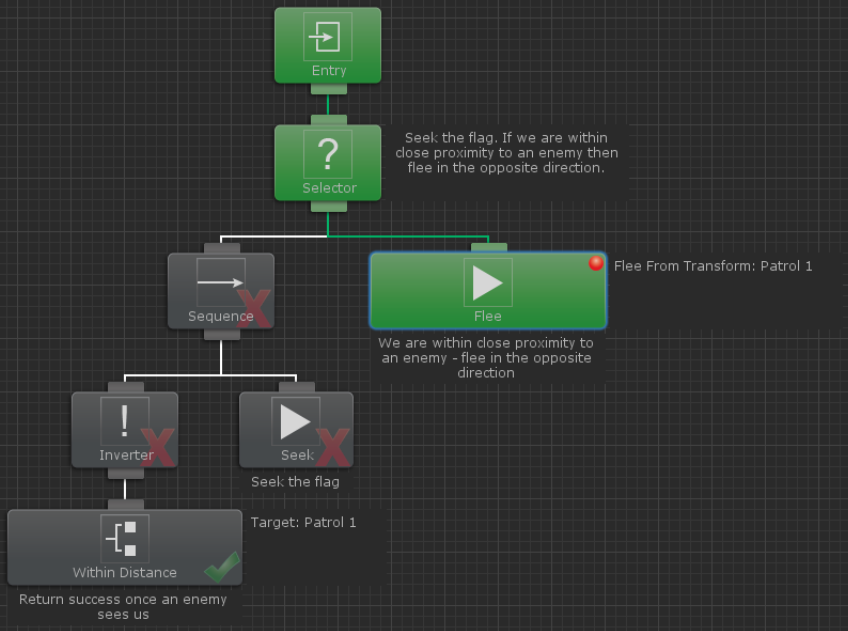
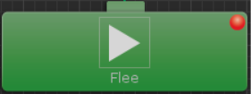
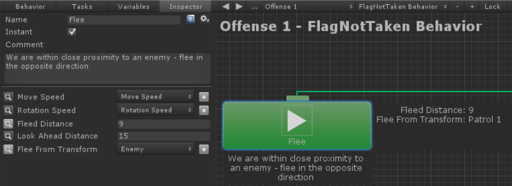
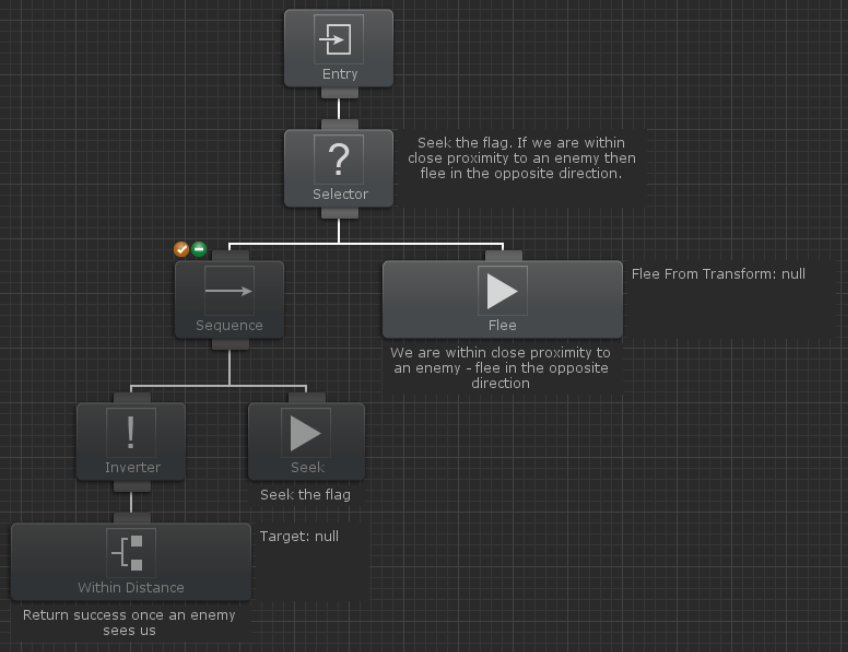

# 디버깅



비헤이비어 트리가 실행 중일 때 다른 태스크가 회색과 초록색 사이에서 색상이 변경되는 것을 볼 수 있습니다. 태스크가 초록색이면 현재 실행 중임을 의미하고 회색이면 실행 중이 아님을 의미합니다. 태스크가 실행된 후 오른쪽 모서리 하단에 체크 표시나 X 표시가 표시되는데 이것은 태스크의 성공 또는 실패를 의미합니다. 태스크가 실행되는 동안에도 인스펙터 내에서 값을 변경할 수 있으며 해당 변경 사항은 게임에 곧바로 반영됩니다.



태스크를 마우스 오른쪽 버튼으로 클릭하면 중단점을 설정할 수 있는 메뉴가 나타납니다. 특정 태스크에 중단점이 설정된 경우 비헤이비어 디자이너는 해당 태스크가 활성화될 때마다 유니티의 게임 플레이를 일시중지시킵니다. 이는 특정 태스크가 실행되는 시점을 확인하려는 경우에 유용합니다.



태스크를 선택하면 변수 이름 왼쪽에 있는 돋보기 버튼을 클릭하며 그래프내에서 변수를 볼 수 있는 옵션이 있습니다. 이렇게 감시되는 변수는 태스크 인스펙터를 열지 않고도 특정 변수의 값을 볼 수 있는 좋은 방법입니다. 위의 예에서는 변수 "Fleed Distance"와 "Flee From Transform"이 감시되고 있으면 Flee 태스크의 오른쪽에 나타납니다.



때로는 특정 태스크 셋에만 집중하고 나머지는 실행하지 않고 싶은 경우가 있을 수 있는데 이럴 때는 실행하지 않으려고 하는 태스크를 비활성화하는 방법으로 원하는 태스크만 실행할 수 있습니다. 태스크 위에 마우스 커서를 놓고 태스크 왼쪽 상단의 주황색 X 버튼을 선택하면 실행되지 않기를 원하는 태스크를 비활성화할 수 있습니다. 비활성화된 태스크는 실행되지 않고 즉시 성공을 반환합니다. 비활성화된 태스크는 그래프 내에서 활성화된 태스크보다 어두운 회색으로 표시됩니다.

또 다른 디버깅 옵션으로는 태스크가 상태를 변경할 때마다 콘솔에 출력하는 것이 있습니다. 태스크 변경 기록(Log Task Changes)가 활성화된 경우 다음과 유사한 로그가 출력됩니다.

```
GameObject - Behavior: Push task Sequence (index 0) at stack index 0
GameObject - Behavior: Push task Wait (index 1) at stack index 0
GameObject - Behavior: Pop task Wait (index 1) at stack index 0 with status Success
GameObject - Behavior: Push task Wait (index 2) at stack index 0
GameObject - Behavior: Pop task Wait (index 2) at stack index 0 with status Success
GameObject - Behavior: Pop task Sequence (index 0) at stack index 0 with status Success
Disabling GameObject - Behavior
```

이러한 메시지는 다음 조각으로 나눌 수 있습니다:

```
{game object name} - {behavior name}: {task change} {task type}
(index {task index}) at stack index {stack index} {optional status}
```

`{game object name}`은 비헤이비어 트리가 연결된 게임 오브젝트의 이름입니다.

`{behavior name}`은 비헤이비어 트리의 이름입니다.

`{task change}`는 태스크의 새로운 상태를 나타냅니다. 예를 들어 태스크는 실행이 시작될 때 스택에 푸시되고 실행이 완료되면 팝됩니다.

`{task type}`은 태스크의 클래스 유형입니다.

`{task index}`는 깊이 우선 탐색에서 태스크의 인덱스입니다.

`{stack index}`는 태스크가 푸시되는 스택의 인덱스입니다. 페러렐(병렬) 노드가 있는 경우 여러 스택을 사용하게 됩니다.

`{optional status}`는 해당 특정 변경에 대한 추가 상태입니다. 팝 태스크는 태스크 상태를 출력합니다.