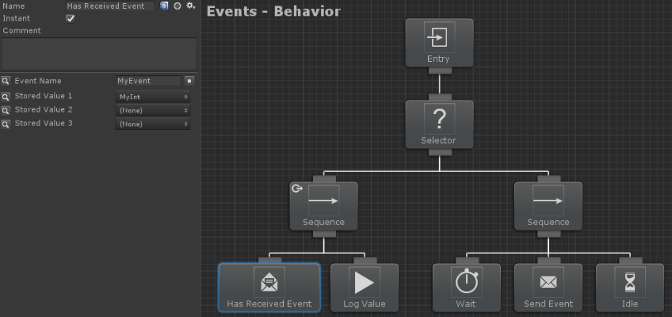

# 이벤트(Events)

비헤이비어 디자이너 내의 이벤트 시스템을 사용하면 비헤이비어 트리가 변경 사항에 쉽게 반응할 수 있습니다. 이 이벤트 시스템은 코드 또는 비헤이비어 트리 태스크를 통해 이벤트를 트리거할 수 있습니다. 이벤트는 Send Event 태스크와 Has Received Event 태스크로 비헤이비어 트리를 통해 신호를 보낼 수 있습니다. 이벤트가 신호되어야 할 때 Send Event 태스크를 사용해야 합니다. Has Received Event 태스크는 컨디셔널 태스크이며 이벤트가 수신되는 즉시 성공을 반환합니다. 이 두 태스크 모두에 대해 이벤트 이름을 지정할 수 있습니다. 이벤트를 제대로 수신하려면 Has Received Event 태스크를 조건부 중단으로 재평가해야 합니다. 다음 트리를 예시로 들 수 있습니다:



첫 번째 틱 동안에는 이벤트가 아직 수신되지 않았기 때문에 Has Received Event 태스크가 실패합니다. 그러면 셀렉터가 오른쪽 분기로 이동하고 Wait 태스크가 시작됩니다. 대기 시간이 끝나면 Send Event 태스크가 이벤트를 보내고 Idle이 시작되어 트리를 활성 상태로 유지합니다. 다음 틱 동안 Has Received Event 태스크는 전송된 이전 이벤트로 인해 성공 상태를 반환합니다. 그런 다음 Send Event 태스크와 함께 전송된 `MyInt` 변수의 값을 출력합니다.

비헤이비어 트리를 통해 이벤트를 보낼 수 있을 뿐만 아니라 코드를 통해 이벤트를 보낼 수도 있습니다. 아래의 예시와 같이 `BehaviorTree.SendEvent` 메서드를 사용하면 지정된 비헤이비어 트리에 이벤트를 보낼 수 있습니다: 

```csharp
var behaviorTree = GetComponent<BehaviorTree>();
behaviorTree.SendEvent<object>("MyEvent", 5);
```

위 예시에서 `"MyEvent"` 이벤트는 매개변수 값이 5인 비헤이비어 트리 컴포넌트로 전송됩니다. 비헤이비어 트리에 Has Received Event 태스크가 포함되어 있으면 그에 따라 반응합니다. Has Received Event 태스크가 이벤트를 수신하는 경우 템플릿 타입은 유요한 개체여야 합니다.

비헤이비어 트리 외부에서 이벤트를 수신할 수도 있습니다. `"MyEvent"` 예제에 이어서, `BehaviorTree.RegisterEvent` 메서드를 사용하면 이 이벤트를 수신할 수 있습니다. `BehaviorTree.UnregisterEvent`는 해당 이벤트 수신을 중지합니다.

```csharp
public void OnEnable()
{
   var behaviorTree = GetComponent<BehaviorTree>();
   behaviorTree.RegisterEvent<object>("MyEvent", ReceivedEvent);
}

public void ReceivedEvent(object arg1)
{
}

public void OnDisable()
{
   var behaviorTree = GetComponent<BehaviorTree>();
   behaviorTree.UnregisterEvent<object>("MyEvent", ReceivedEvent);
}
```