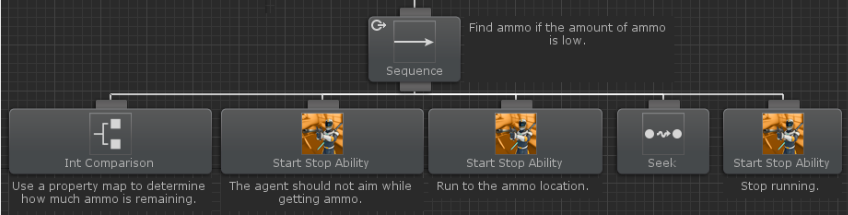
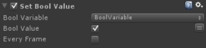

# 다른 에셋과의 통합(Integrations)

비헤이비어 디자이너에는 타사의 에셋과 통합되는 많은 태스크가 있습니다. 이러한 통합의 대부분에는 추가 작업이 필요하지 않으며 비헤이비어 트리에 추가한 다음 해당 값을 할당할 수 있습니다. 다만, 아래의 에셋들과의 통합에는 작동 방식에 대한 자세한 설명이 있습니다.

[Dialogue System](https://opsive.com/support/documentation/behavior-designer/integrations/dialogue-system-for-unity/)

[Playmaker](https://opsive.com/support/documentation/behavior-designer/integrations/playmaker/)

[Ultimate Character Controller](https://opsive.com/support/documentation/behavior-designer/integrations/opsive-character-controllers/)

[uScript](https://opsive.com/support/documentation/behavior-designer/integrations/uscript/)

## 다이얼로그 시스템(Dialogue System)

[다이얼로그 시스템](https://assetstore.unity.com/packages/tools/ai/dialogue-system-for-unity-11672?aid=1100lGdc&utm_campaign=unity_affiliate&utm_medium=affiliate&utm_source=partnerize-linkmaker)은 유니티를 위한 완전한 대화 시스템입니다. 비헤이비어 디자이너는 비헤이비어 트리 내에서 대화, 짖는 소리, 시퀀스 및 퀘스트를 관리할 수 있도록 하여 대화 시스템과 통합됩니다. 또한 다이얼로그 시스템은 비헤이비어 디자이너와 통합되어 Lua와 변수를 동기화하고 시퀀스 명령으로 비헤이비어 트리를 시작/중지할 수 있습니다. 통합 측면에 대한 자세한 내용은 [여기](https://www.pixelcrushers.com/dialogue_system/manual/html/behavior_designer.html)에서 확인할 수 있습니다. 모든 다이얼로그 시스템 통합 파일은 [다운로드 페이지](https://opsive.com/downloads/?pid=803)에 있습니다.

시작하려면 먼저 유니티용 다이얼로그 시스템이 설치되어 있고 통합 패키지를 임포트했는지 확인하십시오. 해당 파일을 가져오면 다이얼로그 시스템으로 비헤이비어 트리를 만들 준비가 된 것입니다. Wait 태스크와 Start Conversation 태스크가 있는 시퀀스 태스크로 매우 기본적인 트리를 만들어보겠습니다:

다이얼로그 시스템이 대화 또는 시퀀스로 완료되면 비헤이비어 디자이너에 콜백하여 비헤이비어 디자이너가 완료되었음을 알립니다. 이것이 발생하려면 Dialogue System Callback 컴포넌트가 비헤이비어 트리가 있는 동일한 게임 오브젝트에 추가되어야 합니다:

이제 실제 기능 변환을 시작할 준비가 되었습니다. 새 Dialogue System Database를 만들고 기본 대화를 생성합니다.

나중에 필요하므로 대화의 이름을 기록해둡니다. 해당 데이터베이스를 Dialogue System Controller에 할당합니다:

마지막 단계는 단순하게 Start Conversation 태스크 내에서 값을 할당하는 것입니다. 필요한 값은 대와의 이름과 액터 게임오브젝트 뿐입니다:

해당 값이 할당되고 플레이버튼을 누르면 게임 화면 상단에 "Hello World!"라는 텍스트가 표시됩니다:

이 주제는 비헤이비어 디자이너와 다이얼로그 시스템의 통합을 깊게 다루지 않습니다. 더 복잡한 예시를 보려면 다이얼로그 시스템 샘플 프로젝트를 살펴보세요.

## 옵시브 캐릭터 컨트롤러(Opsive Character Controller)

**이 통합 패키지는 [다운로드 페이지](https://opsive.com/downloads/?pid=803)에서 다운로드할 수 있습니다.**

옵시브 캐릭터 컨트롤러는 비헤이비어 디자이너와 통합되어 AI가 플레이가 제어하는 캐릭터가 수행하는 모든 기능을 수행하도록 만들어줍니다. 얼티메이트 캐릭터 컨트롤러 통합에는 사격 무기와 근접 무기 모두에서 작동하도록 설계된 데모 씬이 포함되어 있습니다.

통합 패키지를 임포트하면 4개의 샘플 씬이 포함되어 있습니다.

- 1인칭 근접 씬
- 1인칭 사격 씬
- 3인칭 근접 씬
- 3인칭 사격 씬

이 네 씬의 비헤이비어 트리는 정확히 동일하며 유일한 차이점은 플레이어의 시점과 캐릭터가 장착한 무기 뿐입니다.

비헤이비어 디자이너와 함게 사용해야 하는 새 캐릭터를 생성할 때 캐릭터 매니저(Character Manager) 내에서 AI 에이전트를 활성화했는지 확인하십시오. 유니티의 내비게이션 메시를 사용하는 경우 NavMeshAgent 토글도 활성화해야 합니다.

캐릭터를 생성한 다음에는 다음 컴포넌트들을 추가해야 합니다.

- Behavior Tree
- Behavior Tree Agent

Behavior Tree Agent 컴포넌트는 옵시브 캐릭터 컨트롤러 [통합 패키지](https://opsive.com/downloads/?pid=803)에서 찾을 수 있습니다. 데모 씬에서 비헤이비어 디자이너 [프로퍼티 매핑](https://opsive.com/support/documentation/behavior-designer/variables/) 기능에 대한 프로퍼티로 캐릭터의 체력과 탄약을 추가하는 데모 에이전트 컴포넌트도 추가되었음을 알 수 있습니다.

캐릭터를 설정한 후에는 자신만의 비헤이비어 트리를 만들 차례입니다. 포함된 비헤이비어 트리는 비헤이비어 트리 흐름에 대한 훌륭한 개요를 제공하므로 이 문서의 나머지 부분에서는 비헤이비어 트리가 작동하는 방식을 설명합니다. 비헤이비어 디자이너를 최대한 활용하려면 고유한 비헤이비어 트리를 만드는 것이 좋습니다.

포함된 비헤이비어 트리는 다음 기능을 수행합니다:

- 플레이어가 시야 내에 있으면 공격합니다.
- 플레이어가 에이전트를 공격하면 공격합니다.
- 플레이어에게서 소리가 들리면 소리가 발생한 위치로 이동합니다.
- 플레이어를 놓친 경우 플레이어를 찾기위해 수색합니다.
- 필요한 경우 체력을 회복합니다.
- 필요한 경우 탄약을 획득합니다.
- 다른 조치가 필요하지 않다면 순찰합니다.

전체 비헤이비어 트리는 다음과 같습니다:

비헤이비어 트리는 위에서 아래로, 왼쪽에서 오른쪽으로 평가됩니다. 이는 실행되는 맨 처음 태스크가 Entry 태스크 바로 아래에 있는 Sequence 태스크임을 의미합니다:

시퀀스 태스크는 하위 태스크가 실패를 반환할 때까지 모든 하위 태스크를 평가하는 컴포지트 태스크 입니다. 시퀀스 태스크는 하위 태스크 사이의 AND로 생각할 수 있습니다. 이 시퀀스 태스크가 실행할 처음 세 태스크는 다음 실행을 위해 준비하도록 비헤이비어 트리를 재설정한느 것과 관련이 있습니다. 이러한 태스크가 재설정하는 변수는 나중에 설명하겠습니다. 그런 다음 패러렐 태스크를 사용하여 동시에 여러 하위 태스크를 실행합니다. 이 패러렐 태스크가 실행할 두가지 분기가 있습니다:

- 왼쪽 분기는 이동이나 공격 같은 실제 액션을 수행합니다.
- 오른쪽 분기는 Update Position 변수가 true일 때 플레이어의 위치를 최신 상태로 유지합니다.

트리의 주요 기능은 왼쪽 분기에 포함되어 있습니다:

이 분기는 Repeat Forever(계속 반복)로 설정된 리피터 태스크로 상위 태스크가 됩니다. 리피터 태스크는 요청된 상태동안 하위 분기를 계속 실행하는 데코레이터입니다. Repeater Forever가 활성화되어 있기 때문에 리피터는 비헤이비어 트리가 끝날 때까지 분기를 활성 상태로 유지합니다. 셀렉터는 리피터의 상위 태스크입니다. 셀렉터 태스크는 하위 태스크가 성공을 반환할 때하기 하위 태스크를 실행합니다. 셀렉터는 하위 태스크 사이의 OR 동작으로 생각할 수 있습니다.

비헤이비어 트리는 왼쪽에서 오른쪽으로 평가되기 때문에 왼쪽에 있는 분기가 오른쪽에 있는 것보다 우선 순위가 높습니다. 이것은 실행할 첫 번째 분기가 에이전트의 탄약이 부족하지 않은지 확인하는 분기임을 의미합니다:

ammo 분기의 시퀀스 태스크에는 Lower Priority [조건부 중단](https://opsive.com/support/documentation/behavior-designer/conditional-aborts/)이 설정되어 있습니다. 조건부 중단을 사용하면 다른 분기가 활성 상태일 때 비헤이비어 트리가 하위 컨디셔널 태스크를 재평가할 수 있습니다. 캐릭터의 탄약이 떨어지면 캐릭터는 아무 것도 할 수 없으므로 이 분기가 가장 높은 우선 순위를 갖습니다. 낮은 우선 순위 분기(탄약 분기 오른쪽에 있는 분기)가 활성화되고 에이전트가 탄약이 부족하면 조건부 중단은 우선 순위가 낮은 분기를 중단하고 ammo 분기를 실행합니다.

ammo 분기는 Int Comparison 컨디셔널 태스크로 캐릭터가 가지고 있는 탄약의 양을 먼저 확인하는 비교적 간단한 분기입니다. 이 Int Comparison 태스크는 에이전트의 탄약을 일정한 수와 비교합니다.  탄약의 양은 Demo Agent 컴포넌트를 통한 Ammo 프로퍼티 매핑 설정을 통해 검색됩니다. 이 양이 상수보다 작으면 Int Comparison 태스크가 성공을 반환하고 분기가 실행됩니다.

에이전트가 탄약이 부족한 경우 Start Stop Ability 태스크를 통해 조준을 중지합니다. 이것은 얼티메이트 캐릭터 컨트롤러를 위해 생성된 태스크이며 지정된 값에 따라 능력을 시작하거나 중지합니다. 이 경우 캐릭터는 탄약을 회수할 때 조준해서는 안되므로 태스크가 조준 기능을 중지합니다. 또 다른 Start Stop Ability 태스크가 실행되고 이 태스크는 Speed Change 태스크를 시작하여 캐릭터가 탄약위치를 향해 달리기 시작합니다. [Movement Pack](https://opsive.com/assets/behavior-designer-movement-pack/)의 Seek 태스크는 유니티의 내비게이션 메시를 사용하여 캐릭터를 지정된 위치로 이동합니다. 캐릭터가 위치에 도착한 수 Start Stop Ability 태스크는 이번에만 다시 실행되어 Speed Change 태스크를 중지하고 캐릭터가 이동을 중단합니다.

에이전트가 탄약을 필요로하지 않는 경우 다음으로 높은 우선 순위의 분기는 Can See 분기입니다. 이 분기는 플레이어가 시야 내에 있을 때 실제로 플레이어를 공격한다는 점에서 주요 작업을 포함합니다. ammo 분기와 유사하게 can see 분기는 Lower Priority 조건부 중단을 사용하기 때문에 더 낮은 우선 순위의 분기를 중단합니다. Can See 분기는 오른쪽에 있는 분기를 중단할 수 있습니다. 즉, ammo 분기가 can see 분기의 왼쪽에 있기 때문에 ammo 분기를 중단시키지는 못합니다.

Can See 분기 내의 첫 번째 작업은 Movement Pack의 Can See Object 태스크입니다. Can See Object는 레이어 마스크를 사용하여 시야 내에 있는 오브젝트를 탐색합니다. 플레이어는 캐릭터 레이어에 있으므로 태스크는 해당 레이어에 있는 오브젝트만 탐색합니다. 태스크가 플레이어를 찾으면 죽은 플레이어는 공격할 필요가 없기 때문에 Is Alive 태스크가 실행되어 플레이어가 살아있는지 확인합니다. Set Shared GameObject 태스크는 발견된 Can See Object 값을 target 변수로 전송하는 헬퍼 태스크입니다. 이것은 발견된 플레이어 변수에 대해 다른 태스크가 작동할 때 수행되므로 원래 오브젝트가 손실되지 않습니다. 그런 다음 Two Set Bool 태스크가 실행되는데 이 태스크는 플레이어가 길을 잃으면 에이전트가 방황해야 하며 목표물의 위치를 업데이트해야 함을 나타냅니다. 그런 다음 원형의 패러렐 태스크 아래의 오른쪽 분기는 목표물의 마지막 위치 변수로 설정합니다.

그런 다음 왼쪽 분기를 먼저 평가하는 셀렉터 태스크가 실행됩니다. 왼쪽 분기의 목표는 목표물이 시야에 있으면 해당 목표물을 공격하는 것입니다. 이를 수행하기 위해 시퀀스 태스크가 Self  조건부 중단과 함께 사용됩니다. Self 조건부 중단은 새로운 중단 타입이며 이 타입은 현재 분기가 활성 상태인 동안 컨디셔널 태스크를 재평가 합니다. 이 경우 현재 분기에는 셀렉터와 함께 Is Alive 태스크가 포함되어 있으므로 에이전트가 목표물을 시야에 두고 있는 동안 Is Alive를 재평가합니다. 목표물이 더 이상 살아있지 않으면 Is Alive 태스크는 실패를 반환합니다.

셀렉터 태스크가 평가할 첫 번째 분기에는 상위 태스크로 패러렐 태스크가 있습니다. 이 패러렐 태스크는 두 가지 분기를 실행합니다:

- 왼쪽 분기는 목표물이 시야 내에 있으면 공격합니다.
- 오른쪽 분기는 에이전트가 목표물 근처에 있도록 합니다.

왼쪽 Attack 분기는 Can See Object 캐스크를 사용하여 에이전트가 목표물 근처에 있는지 확인합니다. 이 Can See Object 태스크는 대상까지의 거리가 더 작아서 에이전트가 목표물 근처에서만 공격할 수 있기 때문에 첫 번째 Can See Object 태스크와는 다릅니다. 목표물이 근처에 있으면 캐릭터가 계속 조준하도록 하기 위해서 Start Stop Ability 태스크가 실행됩니다. 에이전트가 조준한 후 Start Stop Ability 태스크가 실행되서 실제로 아이템을 사용하여 돌격 소총을 발사하거나 검을 휘두릅니다. 그런 다음 에이턴트가 매 프레임 공격이 연속으로 발동되는 것을 막기 위해 Wait 태스크가 사용됩니다.

Attack 분기가 실행되는 동안 Move Towards 분기도 실행됩니다. 이 분기는 두 부분으로 이루어집니다:

- 목표물을 획득한 후 제자리로 이동합니다.
- 위치에 도착한 후 위치를 유지합니다.

위치로 이동하려면 Within Distance 태스크를 사용하여 에이전트가 대상의 거리 내에 있는지 확인합니다. Self 조건부 중단이 사용되어 현재 분기 내의 태스크가 활성 상태인 동안 Within Distance 태스크가 재평가됩니다. 이 경우에는 Seek 태스크가 됩니다. Seek가 에이전트를 대상 가까이로 이동하는 즉시 Within Distance 태스크는 성공을 반환하고 인버터(Inverter)는 해당 성공을 실패로 변경하여 분기가 실행을 중지합니다. Seek 태스크가 활성화되어 있는 동안 Speed Change 기능이 활성화되어 에이전트가 목표물을 향해 달리게 될 것입니다.

에이전트가 대상의 거리 안으로 이동한 후 오른쪽 분기는 에이전트가 대상의 근처에 있도록 유지합니다. 이 분기와 이전의 Move Towards 분기 사이에는 세 가지의 주요한 차이점이 존재합니다:

- 현재 분기는 대상을 찾는 동안 캐릭터가 달리는 대신 걷게 합니다.
- Within Distance 태스크와 함께 Can See Object 태스크를 사용하므로 공격하는 동안 에이전트가 항상 타깃을 볼 수 있습니다. 예를 들어 타깃이 에이전트 근처에 있더라도 에이전트가 타깃을 볼 수 없도록 하는 구조 내부에서 타깃이 이동할 수 있습니다.
- Idle 태스크는 에이전트가 위치를 찾을 필요가 없는 경우에 사용됩니다. 타깃이 가만히 서있고 시야에 들어오면 에이전트는 위치를 바꾸지 않고 계속 공격할 수 있습니다.

이제 에이전트가 공격하고 타깃을 향해 이동할 것입니다. 타깃이 에이전트에서 벗어나 너무 멀리 이동하면 오른쪽의 Move Toward 분기가 오류를 반환하고 Reset 분기를 실행합니다. 이 Reset 분기는 에이전트가 더 이상 공격하지 않고 조준하지 않도록 하는 두 가지 작업을 실행합니다.

타깃을 처음 획득했을 때 Wander 및 Update Position 변수가 설정되어 타깃을 잃어버린 경우 에이전트가 타깃을 탐색합니다. 에이전트가 타깃을 죽인 경우 에이전트가 돌아다닐 필요가 없으므로 Target Death 분기는 모든 공격 관련 변수를 기본값으로 재설정합니다.

만약 에이전트가 탄약을 얻을 필요가 없고 플레이어가 시야에 들어오지 않는다면, 다음으로 우선 순위가 높은 분기가 실행됩니다. 이 분기는 얼티메이트 캐릭터 컨트롤러의 이벤트 시스템을 사용하여 에이전트가 데미지를 입었는지 여부를 확인합니다. 에이전트가 데미지를 받은 경우 Has Taken Damage 태스크가 성공을 반환하고 분기가 실행됩니다. 에이전트가 데미지를 입으면 먼저 이 분기가 데미지를 입힌 오브젝트의 위치를 가져오고 Wander를 true로 설정합니다. 에이전트가 타깃을 향해 이동하기 전에 먼저 체력이 매우 낮은지 여부를 확인합니다. 체력이 심각할 정도로 낮은 경우 에이전트는 체력 회복 아이템을 찾습니다.

에이전트가 체력 회복 아이템을 찾거나 더 많은 체력이 필요하지 않다고 결정하면 분기가 종료됩니다. Wander 변수가 true로 설정되어 더 높은 우선 순위의 분기가 없으면 Wander 분기가 실행을 시작한다는 것을 기억하십시오.

다음으로 우선 순위가 높은 분기는 Can Hear 분기입니다. 이 분기는 Movement Pack의 Can Hear Object 태스크를 사용하여 소리를 내보내는 오디오 소스가 있는지 확인합니다. 소리가 들리면 에이전트가 Speed Change 태스크를 시작하고 Seek 태스크를 사용하여 시작 위치에서부터 오디오 소스 위치로 이동합니다. Wander 변수도 true로 설정되어 에이전트가 Seek 위치에 도착할 때까지 타깃을 볼 수 없는 경우 에이전트가 주변을 돌아다니게 됩니다.

트리를 실행하는 동안 Wander 태스크가 true로 설정된 경우가 여러 번 있었습니다. Bool Comparison 태스크는 이 Wander 태스크 변수를 true와 비교하여 에이전트가 주변을 돌아다녀야 하는지 여부를 결정합니다. 에이전트가 주변을 돌아다니기 전에 먼저 마지막 위치를 찾아야 합니다. 이 변수는 Update Position 변수가 true일 때마다 설정되며 타깃이 있었던 마지막 위치를 나타냅니다. 에이전트가 Last Position에 도착하면 Wander 태스크가 실행되어 에이전트가 타깃을 탐색할 수 있습니다.

이 시간동안 우선 순위가 높은 분기가 재평가되므로 플레이어가 언제든지 에이전트 시야에 들어오면 캐릭터가 공격을 시작할 수 있도록 현재 분기가 중단됩니다. Wander 태스크는 패러렐 셀렉터 태스크의 상위 태스크로 하위 태스크가 성공을 반환할 때까지 모든 하위 태스크를 실행합니다. Wander 태스크의 오른쪽에는 Wait 태스크가 있으며, 이 태스크는 미리 정해진 기간이 지나면 성공을 반환합니다. 이것은 에이전트가 영원히 방황하는 것을 방지하고 에이전트가 방황하는 시간에 제한을 둘 것입니다.

다른 분기를 실행할 필요가 없으면 트리는 Patrol 분기로 폴백됩니다. 이 분기는 순찰 지점 간에 캐릭터를 이동하고 더 높은 우선 순위의 분기가 중단할 때까지 캐릭터를 이동합니다.

Ammo, Can See, Taken Damage, Can Hear, Wander, Patrol분기가 트리 꼭대기 근처에서 실행되면 Update Position 분기도 실행됩니다. Update Position이 true면 이 분기는 타깃의 위치를 업데이트 합니다. 이 분기는 단일 분기가 Update Position을 true로 설정할 수 없으므로 동일한 태스크를 여러 번 추가하지 않아도 되도록 이 분기가 패러렐 태스크 아래 상단 근처에서 추가되었기 때문에 트리의 나머지 부분과 분리되어 있습니다.

이제 이 개요를 완료했으므로 얼티메이트 캐릭터 컨트롤러로 자신만의 트리를 만들기 시작하기에 충분한 지식이 있어야 합니다. 비헤이비어 디자이너의 비주얼 편집기에 익숙해지기 위해 테모트리를 몇 번 살펴보십시오.

## 플레이메이커(Playmaker)

[플레이메이커](https://assetstore.unity.com/packages/tools/visual-scripting/playmaker-368?aid=1100lGdc&utm_campaign=unity_affiliate&utm_medium=affiliate&utm_source=partnerize-linkmaker)는 유한 상태 머신을 쉽게 만들 수 있는 인기 잇는 시각적 스크립팅 도구입니다. 비헤이비어 디자이너는 플레이메이커가 태스크 또는 컨디셔널 태스크를 수행한 다음 중단된 부분부터 비헤이비어 트리르 재개할 수 있도록하여 플레이메이커와 직접 통합됩니다. 비헤이비어 디자이너가 작동하는 데 플레이메이커가 필요하지 않기 때문에 플레이메이커 통합 파일은 [다운로드 페이지](https://opsive.com/downloads/?pid=803)에 있습니다.

시작하려면 먼저 플레이메이커가 설치되어 있고 통합 패키지를 임포트하였는지 확인하십시오. 이러한 파일을 임포트하면 플레이메이커로 비헤이비어 트리를 만들 준비가 된 것입니다. 시작하려면 두개의 Start FSM 하위 태스크가 있는 시퀀스 태스크로 매우 기본적인 트리를 만듭니다:

다음으로 비헤이비어 트리를 추가한 동일한 게임오브젝트에 두 개의 플레이메이커 FSM 컴포넌트를 추가합니다.

플레이메이커를 열고 새 FSM 만들기를 시작합니다. 이 FSM은 비헤이비어 디자이너가 플레이메이커와 상호작용하는 방식을 보여주는 간단한 FSM이 될 것입니다. 더 복잡한 FSM의 경우 플레이메이커 샘플 프로젝트를 살펴보세요. 비헤이비어 디자이너는 이벤트를 전송하여 플레이메이커 FSM을 시작합니다. "Behavior Tree Listener"라는 새 상태를 추가하고 "StartFSM"이라는 새 전역 이벤트를 추가하여 이 이벤트를 만듭니다. 이벤트는 전역이어야 합니다. 그렇지 않으면 비헤이비어 디자이너가 FSM을 시작할 수 없습니다.

wait 상태, set bool 상태, resume behavior tree(비헤이비어 트리 재개) 상태와 함께 해당 이벤트의 트랜지션을 추가합니다. 비헤이비어 디자이너에서 FSM을 다시 시작할 수 있도록 resume behavior tree 상태에서 Behavior Tree Listener 상태로 전환해야 합니다.

Set Bool 상태 안에서 새 변수를 만들고 해당 값을 true로 설정합니다.

그런 다음 Resume Behavior Tree 상태 안에서 해당 bool 값을 기반으로 성공을 반환하려고 합니다:

이것이 이 FSM을 위한 것입니다. 이전에 생성한 두 번째 FSM에 대해 동일한 상태 및 변수를 생성합니다. 이 FSM에 대해 bool 변수를 true로 설정하지 마십시오.

이제 플레이메이커에서 작업이 완료되었습니다. 비헤이비어 디자이너 내에서 비헤이비어 트리 백업을 엽니다. 왼쪽 플레이메이커 태스크를 선택하고 변수에 값 할당을 시작합니다. 플레이메이커 게임오브젝트는 플레이메이커 FSM 컴포넌트를 추가한 게임 오브젝트에 할당됩니다. FSM 이름은 플레이메이커 FSM의 이름입니다. 이벤트 이름은 플레이메이커 내에서 생성한 글로벌 이벤트의 이름입니다.

이제 올바른 플레이메이커 태스크에 대한 값을 할당해야 합니다. 값은 다른 FSM 이름을 제외하고 왼쪽 플레이메이커 태스크와 동일해야 합니다.

이것이 전부 입니다. 플레이 버튼을 누르면 첫 번째 플레이메이커 태스크가 잠시 실행된 다음 두 번째 플레이메이커 태스크가 실행되기 시작합니다.

두 번째 플레이메이커 태스크가 첫 번째 플레이메이커 FSM보다 먼저 실행되도록 태스크를 바꾸면 두 번째 플레이메이커 FSM이 실패를 반환하고 시퀀스 태스크가 하위 태스크의 실행을 중지하기 때문에 비헤이비어 트리가 첫 번째 플레이메이커 FSM에 도달하지 않습니다.

## uScript

- uScript 에셋은 지원이 중단되었습니다.

[uScript](https://assetstore.unity.com/packages/tools/visual-scripting/uscript-professional-1808?aid=1100lGdc&utm_campaign=unity_affiliate&utm_medium=affiliate&utm_source=partnerize-linkmaker)는 한 줄의 코드도 작성할 필요 없이 복잡한 설정을 만들 수 있는 비주얼 스크립팅 도구입니다. 비헤이비어 디자이너는 uScript가 태스크 또는 컨디셔널 태스크를 수행한 다음 중단된 위치에서 비헤이비어 트리를 재개할 수 있도록 하여 uScript와 직접 통합됩니다. 비헤이비어 디자이너가 작동하는 데 uScript가 필요하지 않기 때문에 uScript 통합 파일은 [다운로드 페이지](https://opsive.com/downloads/?pid=803)에 있습니다.

시작하려면 먼저 uScript가 설치되어 있고 통합 패키지를 임포트하였는지 확인하십시오. 이러한 파일을 임포트하고 나면 uScript로 비헤이비어 트리를 만들 준비가 된 것입니다. 시작하려면 두 개의 Start Graph 하위 태스크가 있는 시퀀스 태스크로 매우 기본적인 트리를 만듭니다:

이제 컴파일된 uScript 그래프를 저장할 두 개의 게임오브젝트를 생성해야 합니다:

uScript를 열고 새 그래프 만들기를 시작합니다. Events/Signals 아래에 있는 Behavior Tree Signal 노드를 추가합니다. 비헤이비어 디자이너가 uScript 그래프를 실행을 시작하려면 이 노드에서 시작합니다. 이 노드에는 Start Signal, Pause Signal, Resume Signal, End Signal. 이렇게 4가지 이벤트가 있습니다. Start Signal은 비헤이비어 트리 태스크가 실행을 시작할 때 사용됩니다. Pause Signal은 비헤이비어 트리가 일시중지될 때 호출되고, Resume Signal은 비헤이비어 트리가 일시중지된 상태에서 재개될 때 호출됩니다. 마지막으로 uScript작업이 끝나면 End Signal이 호출됩니다. 그래프의 경우 몇 개의 노드만 만들 것입니다. uScript 샘플 프로젝트는 더 복잡한 uScript 그래프를 보여줍니다. 3초의 지연이 있는 노드를 만들고 bool을 설정한 다음 비헤이비어 트리를 다시 시작합니다. Resume Behavior Tree 노드는 Actions/Behavior Designer 아래에 있습니다:

이제 Owner 게임오브젝트와 bool 변수를 생성해야 합니다.

uScript 그래프를 저장하고 컴포넌트를 첫 번째 uScript 그래프 게임오브젝트에 할당합니다.

uScript가 컴포넌트를 마스터 게임오브젝트에 할당할 것인지 묻는 경우 아니오를 선택하십시오.

uScript 그래프를 하나 더 만듭니다. bool을 false로 설정하는 것을 제외하고 마지막 그래프와 동일하게 만듭니다:

마지막으로 해당 그래프를 저장하고 컴포넌트를 두 번때 uScript 게임오브젝트에 할당합니다.

거의 다 완료되었습니다. 이제 비헤이비어 디자이너 내에서 태스크에 올바른 uScript 게임오브젝트를 할달하기만 하면 됩니다. 비헤이비어 디자이너 내에서 비헤이비어 트리를 다시 엽니다. 왼쪽 uScript 태스크를 클릭하고 uScript 게임오브젝트를 첫 번째 uScript 그래프 게임 오브젝트에 할당합니다.

올바른 uScript 태스크에 대해 동일한 작업을 수행하고 uScript 게임오브젝트를 두 번째 uScript 그래프 게임 오브젝트에만 할당합니다. 이게 전부 입니다. 플레이 버튼을 누르면 첫 번째 uScript 태스크가 3초 동안 실행된 다음 두 번째 uScript 태스크가 실행되는 것을 볼 수 있습니다.

두 번째 uScript 그래프가 첫 번째 uScript 그래프보다 먼저 실행되도록 태스크를 바꾸면 두 번째 uScript 그래프가 실패를 반환하고 시퀀스 태스크가 하위 태스크의 실행을 중지했기 때문에 비헤이비어 트리가 첫 번째 uScript 그래프에 도달하지 않습니다.