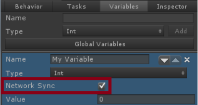

# 네트워킹

비헤이비어 디자이너는 유니티 5.1에 도입된 유니티의 네트워킹 시스템을 지원합니다.

네트워킹을 복잡한 주제이므로 계속하기 전에 먼저 [유니티의 네트워킹 문서](https://docs.unity3d.com/Manual/UNetOverview.html)를 살펴보는 것이 좋습니다.

공유 변수는 네트워크를 통해 서버에서 클라이언트로 자동으로 동기화될 수 있습니다. 이것은 변수의 세부 정보를 열고 "Network Sync"를 선택하여 활성화할 수 있습니다:



변수를 올바르게 동기화하기 위해서는 ENABLE_MULTIPLAYER [컴파일러 정의](https://docs.unity3d.com/Manual/PlatformDependentCompilation.html)를 추가해야 합니다.

현재 네트워킹 제한으로 인해 ClientRpc 호출은 오버로드 될 수 없으므로 미리 타입을 알아야 합니다. 이는 다음 타입의 변수만 동기화 할 수 있음을 의미합니다.

- bool
- Color
- float
- GameObject
- int
- Quaternion
- Rect
- string
- Transform
- Vector2
- Vector3
- Vector4

변수를 동기화 하려면 [런타임 소스 코드](https://opsive.com/support/documentation/behavior-designer/installation/)의 Behavior 컴포넌트를 사용해야 합니다. 이것은 유니티 네크워킹 버그의 결과입니다. ClientRpc 호출은 하위 클래스의 상위 클래스에서 호출할 수 없습니다. 버그 보고서가 제출되었으며 수정을 기다리고 있습니다. 이 버그는 콘솔에 다음과 같은 경고를 표시합니다:

```
Failed to invoke RPC [RpcPath]([ObjectID]) on netID [NetID]
```

여기서 `[RpcPath]`는 메서드 경로, `[ObjectID]`는 오브젝트의 ID, `[NetID]`는 네트워크 ID입니다.