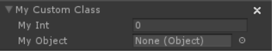
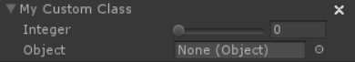

# 오브젝트 드로워(Object Drawers)

오브젝트 드로워는 유니티의 기능인 [프로퍼티 드로워](https://docs.unity3d.com/Manual/editor-PropertyDrawers.html)와 매우 유사합니다. 오브젝트 드로워를 사용하면 인스펙터 내에서 다양한 오브젝트의 모양을 커스터마이징할 수 있습니다. 예를 들어 [자신만의 공유 변수 생성하기](https://opsive.com/support/documentation/behavior-designer/variables/creating-shared-variables/) 토픽에서 찾을 수 있는 공유 커스텀 오브젝트 예제를 수정할 수 있습니다. 기본 인스펙터에서 SharedCustomClass 변수는 다음과 같이 보여집니다:



이 예시에서는 오브젝트 드로워를 사용하여 0에서 10 사이의 정수 범위를 제한할 수 있습니다:



이 작업을 수행하기 위해 다음의 오브젝트 드로워가 사용되었습니다(이 스크립트는 Editor 폴더 안에 있어야 합니다):

```csharp
using UnityEngine;
using UnityEditor;
using BehaviorDesigner.Editor;

[CustomObjectDrawer(typeof(CustomClass))]
public class CustomClassDrawer : ObjectDrawer
{
   public override void OnGUI(GUIContent label)
   {
      var customClass = value as CustomClass;
      EditorGUILayout.BeginVertical();
      if (FieldInspector.DrawFoldout(customClass.GetHashCode(), label))
      {
         EditorGUI.indentLevel++;
         customClass.myInt = EditorGUILayout.IntSlider("Integer", 
            customClass.myInt, 0, 10);
         customClass.myObject = EditorGUILayout.ObjectField("Object",
            customClass.myObject, typeof(UnityEngine.Object), true);
         EditorGUI.indentLevel--;
      }
      EditorGUILayout.EndVertical();
   }
}
```

오브젝트 드로워가 작동하기 위해 재정의해야 하는 메서드는 OnGUI(GUIContent label) 메서드가 유일합니다. 레이블 필드는 그려지는 필드의 이릅입니다. 프로퍼티 드로워와 마찬가지로 클래스 타입 또는 어트리뷰트 별로 프로퍼티 드로워를 지정할 수 있습니다. 위의 예시는 클래스 타입 메서드를 사용하고 있습니다.

다른 에시로는 유니티 예제에서 사용된 Range 어트리뷰트를 오브젝트 드로워로 변환합니다. 먼저 어트리뷰트를 생성해야 합니다:

```csharp
using UnityEngine;
using BehaviorDesigner.Runtime.Tasks;
using BehaviorDesigner.Runtime.ObjectDrawers;

public class RangeAttribute : ObjectDrawerAttribute
{
   public float min;
   public float max;

   public RangeAttribute(float min, float max)
   {
      this.min = min;
      this.max = max;
   }
}
```

이제 어트리뷰트가 생성되었으므로 실제 오브젝트 드로워를 생성해야 합니다(이 스크립트는 Editor 폴더 안에 있어야 합니다):

```csharp
using UnityEngine;
using UnityEditor;
using BehaviorDesigner.Editor;

[CustomObjectDrawer(typeof(RangeAttribute))]
public class RangeDrawer : ObjectDrawer
{
   public override void OnGUI(GUIContent label)
   {
      var rangeAttribute = (RangeAttribute)attribute;
      value = EditorGUILayout.Slider(label, (float)value, rangeAttribute.min,
          rangeAttribute.max);
   }
}
```

이 두 가지가 모두 생성되면 태스크 내에서 사용할 수 있습니다:

```csharp
using UnityEngine;
using BehaviorDesigner.Runtime;
using BehaviorDesigner.Runtime.Tasks;
using BehaviorDesigner.Runtime.ObjectDrawers;

public class NewAction : Action
{
   [Range(5, 10)]
   public float rangedFloat;
   public override TaskStatus OnUpdate()
   {
      Debug.Log(rangedFloat);
      return TaskStatus.Success;
   }
}
```

이것은 태스크 인스펙터에서 다음과 같이 표시됩니다.

