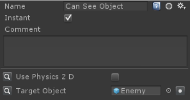
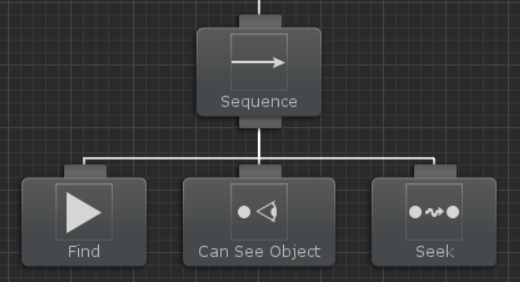
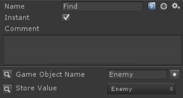
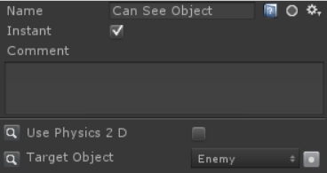

# 씬 오브젝트 참조(Referencing Scene Objects)

트리를 생성할 때 공유 변서나 태스크로부터 씬 안에 있는 오브젝트를 참조하는 방법이 일반적입니다. 예를 들어 이 트리에서 Can See Object는 Enemy 오브젝트를 볼 수 있는지 여부를 결정합니다:



테스트하면서 모든 것이 잘 작동하고 있다는 것을 확인하였고 이제 프리팹을 만들어 씬에 여러 에이전트를 가질 수 있습니다. 하지만 곧바로 에이전트를 프리팹으로 만들고 씬에서 제거하자마자 Target Object의 참조가 missing이 되었음을 알 수 있습니다. 이 문제가 발생하는 이유는 프로젝트 레벨의 에셋(프리팹 또는 전역 변수 파일)이 씬의 오브젝트를 참조할 수 없기 때문입니다. 이것은 유니티의 제한 사항이며 이를 극복하는 방법은 프리팹을 생성한 후 런타임에 변수를 채우는 것입니다.

씬 참조 오브젝트는 런타임에 다양한 방법으로 채울 수 있습니다. 한 가지 방법은 Find 태스크를 사용하고 이름으로 오브젝트를 검색하는 것입니다:







Find 태스크가 시작외면 "Enemy"라는 게임 오브젝트를 검색한 다음 SharedVariable에 할당합니다. Can See Object가 실행되면 해당 SharedVariable을 사용하여 타깃 오브젝트를 검색합니다.

런타임에 값을 채우는 또 다른 방법은 객체에 대한 참조가 있는 컴포넌트가 씬에 이미 배치되어 있는 것입니다. 프리팹이 생성된 이후에 이 컴포넌트는 Can See Object가 사용하는 SharedVariable의 값을 설정할 수 있게 해줍니다.

```csharp
using UnityEngine;
using BehaviorDesigner.Runtime;

public class Spawner : MonoBehaviour
{
    public GameObject m_Enemy;

    public void Start()
    {
        var behaviorTree = GetComponent<BehaviorTree>();
        behaviorTree.SetVariableValue("Enemy", m_Enemy);
    }
}
```