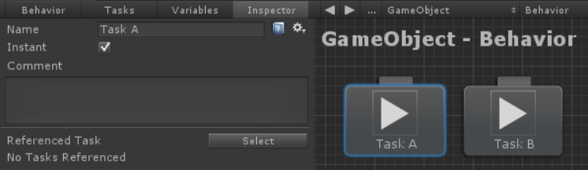
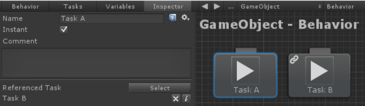
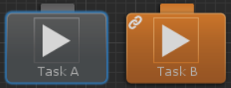

# 참조 태스크(Referencing Tasks)

새 태스크를 작성할 때 경우에 따라 해당 태스크 내의 다른 태스크에 액세스해야할 수 있습니다. 예를 들어 `TaskA`는 `TaskB.SomeFloat`의 값을 원할 수 있습니다. 이를 수행하려면 `TaskA`에서 `TaskB`를 참조해야 합니다. 이 예시에서 `TaskA`는 다음과 같습니다:

```csharp
using UnityEngine;
using BehaviorDesigner.Runtime.Tasks;

public class TaskA : Action
{
   public TaskB referencedTask;
   public void OnAwake()
   {
      Debug.Log(referencedTask.SomeFloat);
   }
}
```

`TaskB`는 다음과 같습니다:

```csharp
using UnityEngine;
using BehaviorDesigner.Runtime.Tasks;

public class TaskB : Action
{
   public float SomeFloat;
}
```

비헤이비어 트리 내의 비헤이비어 트리에 이 두 태스크를 모두 추가하고 `TaskA`를 선택합니다.



Select 버튼을 클릭합니다. 비헤이비어 트리 내에서 다른 태스크를 선택할 수 있는 링크 모드로 들어갑니다. `TaskB`를 선택하면 `TaskB`가 참조 태스크로 연결된 것을 볼 수 있습니다:



이것이 전부 입니다. 이제 비헤이비어 트리를 실행하면 TaskA가 TaskB의 SomeFloat 값을 출력할 수 있습니다. 참조된 태스크 이름 오른쪽에 있는 "X" 버튼을 클릭하여 참조를 지울 수 있습니다. "i" 버튼을 클릭하면 연결된 태스크가 주황색으로 강조 표시됩니다:



태스크는 배열을 사용하여 참조할 수도 있습니다:

```csharp
public class TaskA : Action
{
   public TaskB[] referencedTasks;
}
```