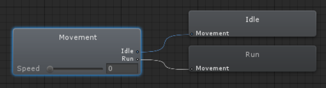
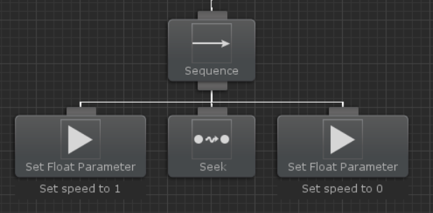

# 애니메이션 동기화(Syncing Animations)

비헤이비어 디자이너에는 트리 안에서 애니메이션을 재생할 수 있는 Animator 태스크 세트가 포함되어 있습니다:

이것은 블렌드 트리를 사용하여 Speed 매개변수를 기반으로한 Idle 상태와 Run 상태를 블렌딩하는 매우 간단한 애니메이터 컨트롤러입니다. 그런 다음 이 블렌드 트리를 Seek 태스크와 동기화하려면 비헤이비어 트리가 다음과 같이 구성됩니다:

Seek 태스크가 시작되기 전에 Speed 매개변수는 1로 설정되어 블렌드 트리가 Run 애니메이션을 재생할 수 있습니다. Seek 태스크가 완료되면 Speed 매개변수가 0으로 설정되어 Idle 애니메이션을 다시 재생합니다.

작은 비헤이비어 트리와 애니메이션 컨트롤러를 사용하면 이 프로세스가 잘 작동합니다. 그러나 에이전트의 애니메이션 양이 증가함에 따라 이 방법은 복잡해지기 시작합니다. 또한 비헤이비어 트리는 모든 애니메이터 작업과 함께 극도로 장황해지기 시작하며 애니메이터 컨트롤러 내에서 트랜지션을 변경하면 해당 애니메이터 컨트롤러의 변경 사항과 함께 작동하도록 비헤이비어 트리를 다시 작업해야 합니다.

이 방법보다는 더 좋은 방법이 있습니다.

비헤이비어 트리 내에서 애니메이션을 동기화하는 데 권장되는 접근 방식은 비헤이비어 트리 내에서 애니메이션을 동기화하지 않는 것입니다. 대신 에이전트의 캐릭터 컨드롤러가 대신 처리해야 합니다. 유니티의 NavMeshAgent를 예로 들자면, 비헤이비어 트리가 NavMeshAgent의 destination을 설정하면(예:Seek 태스크) NavMeshAgent의 velocity가 목표를 향해 이동하도록 변경됩니다. 그런 다음 캐릭터 컨트롤러는 velocity를 사용하고 움직임을 애니메이터가 컨트롤러가 이해할 수 있는 매개변수로 변환해야 합니다.

MecWarrior는 이를 수행하는 방법에 대한 훌륭한 튜토리얼을 제공합니다. MecWarrior 사이트는 더이상 운영되지 않지만 캐시된 버전의 튜토리얼은 [여기](https://web.archive.org/web/20160317180801/http://mecwarriors.com/2014/12/09/navmesh-and-mecanim/)에서 찾을 수 있습니다. 유니티는 [문서](https://docs.unity3d.com/Manual/nav-CouplingAnimationAndNavigation.html) 내에 유사한 자습서도 있습니다. Apex Path 및 A* Pathfinding Project를 사용하여 유사한 구현을 수행할 수 있습니다.

이 접근 방식의 장점은 비헤이비어 트리가 애니메이션을 전혀 이식하지 못한 상태로 [루트 모션](https://docs.unity3d.com/Manual/RootMotion.html)으로도 작동할 수 있다는 것입니다. 또한 Animator 태스크로 트리를 지나치게 복잡하게 만들지 않고 트리를 훨씬더 깔끔하게 만듭니다. Ultimate Character Controller는 이 접근 방식을 사용하고 해당 에셋에 대해 꽤 큰 비헤이비어 트리를 만들었습니다. [이 페이지](https://opsive.com/support/documentation/behavior-designer/integrations/opsive-character-controllers/)에서 비헤이비어 트리를 볼 수 있으며 트리 내에 Animator 태스크가 없음을 알 수 있습니다. 브리지 컴포넌트는 NavMeshAgent의 velocity를 캐릭터 컨트롤러의 입력에 연결하여 3인칭 컨트롤러가 애니메이션을 처리할 수 있도록 합니다.