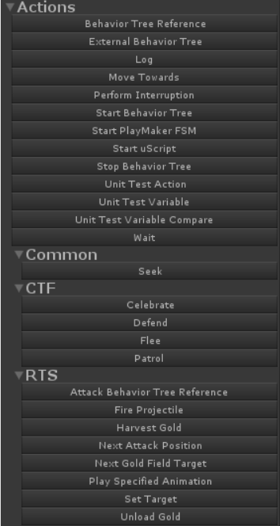
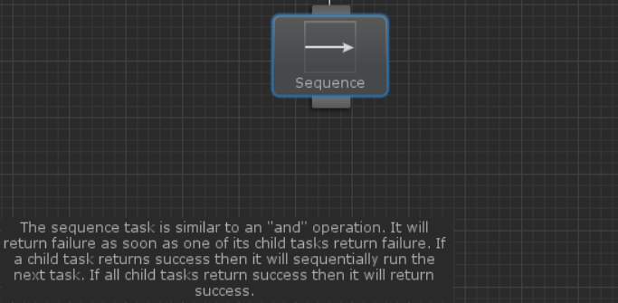

# 태스크 어트리뷰트(Task Attributes)

비헤이비어 디자이너는 다음과 같은 태스크 어트리뷰트를 제공합니다: HelpURL, TaskIcon, TaskCategory, TaskDescription, LinkedTask

## HelpURL

HelpURL 어트리뷰트는 태스크 인스펙터에서 오른쪽 상단에 문서 아이콘을 표시하게 만들어주고 그 아이콘을 클릭하면 어트리뷰트의 매개변수로 넣은 URL로 연결되도록 만들어줍니다.

```csharp
[HelpURL("http://www.example.com")]
public class MyTask : Action
{
}
```

## TaskIcon

태스크 아이콘은 TaskIcon 어트리뷰트를 사용하여 비헤이비어 트리 내에서 표시되며 태스크가 수행하는 작업을 시각화하는데 사용됩니다. 아이콘 이미지의 경로는 루트 프로젝트 폴더에 상대적으로 동작하며 키워드{SkinColor}는 현재 유니티 스킨 색상인 "Light" 또는 "Dark"로 대체하면 됩니다.

```csharp
[TaskIcon("Assets/Path/To/{SkinColor}Icon.png")]
public class MyTask : Action
{
}
```

## TaskCategory

점점 더 많은 태스크를 생성함에 따라 조직에 문제가 되기 시작합니다. 이것을 해결하기 위해 TaskCategory 어트리뷰트를 사용할 수 있습니다.

```csharp
[TaskCategory("Common")]
public class Seek : Action
{
}
```

위 코드로 Seek 태스크는 Common 카테고리로 분류됩니다:



카테고리의 이름을 슬래시로 구분하여 카테고리를 중첩할 수 있습니다:

```csharp
[TaskCategory("RTS/Harvester")]
public class HarvestGold : Action
{
}
```

## TaskDescription

TaskDescription 어트리뷰트를 사용하면 그래프 뷰 안에서 클래스 수준의 주석을 표시할 수 있습니다. 예를 들어 시퀀스에 대한 설명을 다음과 같이 추가할 수 있습니다:

```csharp
[TaskDescription("The sequence task is similar to an \"and\"operation. ..."]
public class Sequence : Composite
{
}
```

이 설명은 그래프의 왼쪽 하단 영역에 표시됩니다:



## LinkedTask

[변수](https://opsive.com/support/documentation/behavior-designer/variables/)는 태스크 간에 정보를 공유할 때 유용합니다. 그러나 "SharedTask"와 같은 공유 변수 타입은 없습니다. 태스크 그룹이 동일한 태스크를 공유하도록 하려면 LinkedTask 어트리뷰트를 사용하십시오. 예를 들어, 태스크 가드 태스크를 살펴보면, 태스크 가드와 함께 하나의 태스크를 참조하면 동일한 태스크가 원래 태스크 가드 태스크를 다시 참조합니다. 연결 태스크는 필요하지 않으며 필드에 동기화된 값이 있는지 확인하는 것이 더 확실한 어트리뷰트입니다. 태스크 연결을 활성화하려면 필드에 다음 어트리뷰트를 추가하세요:

```csharp
[LinkedTask]
public TaskGuard[] linkedTaskGuards = null;
```

에디터 내에서 링크를 수행하려면 [다른 태스크 참조](https://opsive.com/support/documentation/behavior-designer/referencing-tasks/)와 동일한 작업을 수행하십시오.