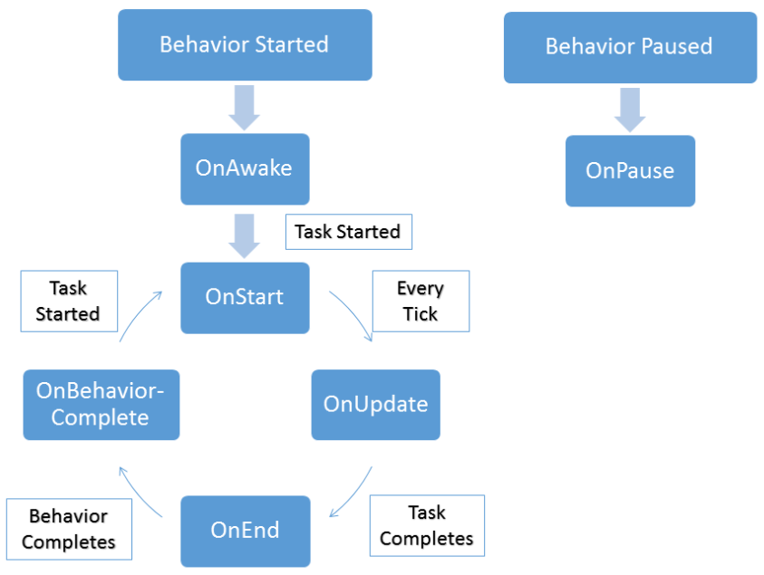

# 태스크(Tasks)

가장 높은 수준에서 비헤이비어 트리는 태스크들의 모음으로 태스크에는 유니티의 모노비헤이비어(MonoBehavior)와 유사한 API를 통해 자신의 태스크를 작성하는 일을 최대한 쉽게 설계되었습니다. 태스크 클래스에는 다음과 같은 API가 있습니다.

```csharp
// OnAwake는 비헤이비어 트리가 활성화될 때 한 번 호출됩니다.
// 생성자와 같은 방식으로 생각하면 됩니다.
void OnAwake();

// OnStart는 실행 직전에 호출됩니다.
// 이전 실행에서 재설정해야 하는 모든 변수를 설정하는 데 사용됩니다.
void OnStart();

// OnUpdate는 실제 태스크를 실행합니다..
TaskStatus OnUpdate();

// OnFixedUpdate는 FixedUpdate 루프 중에 실행됩니다.
// TaskStatus는 OnUpdate 내에서 반환되어야 합니다.
void OnFixedUpdate();

// OnEnd는 태스크가 성공하거나 실해패서 실행이 끝났을 때 호출됩니다.
void OnEnd();

// OnPause는 비헤이비어가 일시 중지되거나 다시 시작될 때 호출됩니다.
void OnPause(bool paused);

// 프라이오리티 셀렉터(Priority Selector, 우선 순위 셀렉터)에서 사용하는 태스크의 
// 우선 순위를 반환합니다.
float GetPriority();

// 유틸리티 이론(Utility Theory)용 유틸리티 셀렉터(Utility Selector)에서 사용하는
// 테스크의 유틸리티를 반환합니다.
float GetUtility();

// OnBehaviorComplete는 비헤이비어 트리 실행이 완료된 후에 호출됩니다.
void OnBehaviorComplete();

// OnReset은 인스펙터에서 공개된 프로퍼티를 수정할 때 호출됩니다.
void OnReset();

// OnDrawGizmos가 태스크에서 호출되도록 허용합니다.
void OnDrawGizmos();

// 이 태스크를 소유하는 비헤이비어에 대한 참조를 유지합니다.
Behavior Owner;
```

태스크에는 이름(Name), 코멘트(Comment) 및 인스턴트(Instant), 이렇게 세 가지 노출된 프로퍼티가 있습니다. 인스턴트는 태스크가 하는 일에서 명확하지 않은 유일한 속성입니다. 태스크가 성공 또는 실패를 반환하면 동일한 업데이트 틱 내에서 다음 태스크로 즉시 이동합니다. 인스턴트 태스크의 선택을 취소하면 다음 태스크가 실행되기 전에 업데이트 틱을 기다립니다. 이것은 비헤이비어 트리를 조절(throttle)하는 쉬운 방법입니다.

태스크가 실행될 때는 다음 순서도를 따릅니다:



## 상위 태스크(Parent Tasks)

상위 태스크는 비헤이비어 트리 내의 컴포지트 및 데코레이터 태스크입니다. ParentTask API에는 유니티의 MonoBehavior 클래스와 동등한 API가 없지만 각 메서드가 사용되는 용도를 결정하기 쉽습니다:

```csharp
// 상위 태스크가 가질 수 있는 최대 하위 태스크의 수
// 보통 1 또는 int.MaxValue입니다.
public virtual int MaxChildren();

// 현재 태스크가 패러렐 태스크인지 판단하기 위한 bool 값입니다.
public virtual bool CanRunParallelChildren();

// 현재 활성화된 하위 태스크의 인덱스입니다.
public virtual int CurrentChildIndex();

// 현재 태스크를 실행할 수 있는지 여부를 결정하는 bool 값입니다.
public virtual bool CanExecute();

// 실행 상태에 데코레이터를 적용합니다.
public virtual TaskStatus Decorate(TaskStatus status);

// 하위 태스크의 실행과 상태를 childStatus로 상위 태스크에 알립니다.
public virtual void OnChildExecuted(TaskStatus childStatus);

// childIndex 번째의 실행되었음과 그 상태를 childStatus로 상위 태스크에 알립니다.
public virtual void OnChildExecuted(int childIndex, TaskStatus childStatus);

// 하위 태스크가 실행을 시작한 태스크를 알립니다.
public virtual void OnChildStarted();

// childIndex 번째 자식의 실행이 시작했음을 패러렐 태스크에 알립니다.
public virtual void OnChildStarted(int childIndex);

// 패러렐 태스크와 같은 일부 상위 태스크가 상태를 재정의할 수 있도록 합니다.
public virtual TaskStatus OverrideStatus(TaskStatus status);

// 인터럽트 노드가 인터럽트된 경우 상태를 무시합니다.
public virtual TaskStatus OverrideStatus();

// 조건부 중단이 트리거되었으며 하위인텍스가 재설정되어야 함을 컴포지트 태스크에 알립니다.
public virtual void OnConditionalAbort(int childIndex);
```

## 새 컨디셔널 태스크 작성(Writing a New Conditional Task)

이 토픽은 두 부분으로 나뉩니다. 첫 번째 부분은 새 컨디셔널 태스크 작성에 대해서 설명하고 두 번째 부분([이 페이지를 참조](https://opsive.com/support/documentation/behavior-designer/writing-a-new-action-task/))은 새 액션 태스크 작성에 대해 설명합니다. 컨디셔널 태스크는 물체가 시야 내에 있는지 여부를 결정하고 액션 태스크는 시야에 있는 물체를 향하도록 할 것입니다. 또한 두 태스크 모두에 [변수](https://opsive.com/support/documentation/behavior-designer/variables/)를 사용할 것입니다. 우리는 이 토픽에 대해 비디오를 만들었으며 [유튜브](https://www.youtube.com/watch?v=q58ELfkyjQk)에서 시청하실 수 있습니다.

우리가 작성할 첫 번째 태스크는 `WithinSight` 태스크입니다. 이 태스크는 게임 상태를 변경하지 않고 게임 상태를 확인하는 것이므로 이 태스크는 컨디셔널 태스크에서 파생됩니다. `BehaviorDesigner.Runtime.Tasks` 네임스페이스가 포함되어 있는지 확인합니다.

```csharp
using UnityEngine;
using BehaviorDesigner.Runtime.Tasks;

public class WithinSight : Conditional
{
}
```

이제 세 개의 public 변수와 하나의 private 변수를 만들어야 합니다.

```csharp
using UnityEngine;
using BehaviorDesigner.Runtime;
using BehaviorDesigner.Runtime.Tasks;

public class WithinSight : Conditional
{
   public float fieldOfViewAngle;
   public string targetTag;
   public SharedTransform target;
   private Transform[] possibleTargets;
}
```

`fieldOfViewAngle` 변수는 물체가 볼 수 있는 시야각을 의미합니다. 

`targetTag`는 개체가 이동할 수 있는 대상의 태그입니다.

`target`은 `WithinSight` 태스크와 정면 이동 태스크 모두에서 사용할 공유 변수(shared variables) 입니다. 공유 변수를 사용하는 경우에는 `BehaviorDesigner.Runtime` 네임스페이스를 포함해야 합니다. 

마지막 변수인 `possibleTargets`는 `targetTag`가 있는 모든 Transform의 캐시입니다. 태스크 API를 살펴보면 `OnAwake` 혹은 `OnStart` 메서드 내에서 해당 캐시를 생성할 수 있음을 알 수 있습니다. `WithinSight` 태스크가 활성화/비활성화됨에 따라 가능한 Transform 목록이 변경되지 않을 것이기 때문에 `OnAwake` 내에서 캐싱을 수행할 것입니다:

```csharp
public override void OnAwake()
{
    var targets = GameObject.FindGameObjectsWithTag(targetTag);
    possibleTargets = new Transform[targets.Length];
    for (int i = 0; i < targets.Length; ++i) 
    {
       possibleTargets[i] = targets[i].transform;
    }
}
```

이 `OnAwake` 메서드는 `targetTag`가 있는 모든 게임오브젝트를 찾은 다음 `possibleTargets` 배열에서 Transform 캐싱을 반복합니다. 그런 다음 재정의된 `OnUpdate` 메서드에서 `possibleTargets` 배열을 사용합니다:

```csharp
public override TaskStatus OnUpdate()
{
    for (int i = 0; i < possibleTargets.Length; ++i) 
		{
         if (WithinSight(possibleTargets[i], fieldOfViewAngle)) 
	  		 {
            target.Value = possibleTargets[i];
            return TaskStatus.Success;
         }
    }
    return TaskStatus.Failure;
}
```

태스크가 업데이트될 때마다 `possibleTargets`가 시야 내에 있는지 확인합니다. 하나의 대상이 시야 내에 있으면 `target` 값을 설정하고 성공을 반환합니다. 이 목표 값을 설정하면 `Move Towards` 태스크가 어떤 방향으로 이동할지 알 수 있으므로 중요합니다. 시야 내에 목표가 없으면 태스크는 실패를 반환합니다. 이 태스크의 마지막 부분은 `WithinSight` 메서드입니다:

```csharp
public bool WithinSight(Transform targetTransform, float fieldOfViewAngle)
{
   Vector3 direction = targetTransform.position - transform.position;
   return Vector3.Angle(direction, transform.forward) < fieldOfViewAngle;
}
```

이 메서드는 먼저 현재 Transform과 `targetTransform` 사이의 방향 벡터를 가져옵니다. 그런 다음 방향 벡터와 현재 forward 벡터 사이의 각도를 계산하여 각도를 결정합니다. 해당 각도가 `fieldOfViewAngle`보다 작으면 `targetTransform`이 현재 Transform의 시야 내에 있는 것입니다.

이것이 바로 `WithinSight` 태스크를 위한 것입니다. 전체 태스크 스크립트는 다음과 같습니다:

```csharp
using UnityEngine;
using BehaviorDesigner.Runtime;
using BehaviorDesigner.Runtime.Tasks;
public class WithinSight : Conditional
{
   // 오브젝트가 볼 수 있는 각도의 넓이
   public float fieldOfViewAngle;
   // 타깃의 태그
   public string targetTag;
   // 타깃이 발견되면 target 변수를 설정하여 후속 태스크가 target인 오브젝트를
   // 알 수 있도록 합니다.
   public SharedTransform target;
   // 타깃이 될 수 있는 모든 대상에 대한 캐시
   private Transform[] possibleTargets;

   public override void OnAwake()
   {
      // targetTag 태그가 있는 모든 Transform을 캐싱합니다.
      var targets = GameObject.FindGameObjectsWithTag(targetTag);
      possibleTargets = new Transform[targets.Length];
      for (int i = 0; i < targets.Length; ++i)
      {
         possibleTargets[i] = targets[i].transform;
      }
   }

   public override TaskStatus OnUpdate()
   {
      // 타깃이 시야 내에 있으면 성공을 반환
      for (int i = 0; i < possibleTargets.Length; ++i) 
      {
         if (WithinSight(possibleTargets[i], fieldOfViewAngle)) 
         {
            // 다른 태스크가 시야 내에 있는 Transform을 알 수 있도록 타깃을 설정합니다.
            target.Value = possibleTargets[i];
            return TaskStatus.Success;
         }
      }
      return TaskStatus.Failure;
   }

   // targetTransform이 현재 Transform의 시야 내에 있으면 true를 반환합니다.
   public bool WithinSight(Transform targetTransform, float fieldOfViewAngle)
   {
      Vector3 direction = targetTransform.position - transform.position;
      // direction과 forward의 각도가 시야각보다 작으면 오브젝트가 시야 내에 있습니다.
      return Vector3.Angle(direction, transform.forward) < fieldOfViewAngle;
   }
}
```

이 토픽의 두 번째 부분으로 이동하여 [Move Towards 태스크를 작성](https://opsive.com/support/documentation/behavior-designer/writing-a-new-action-task/)합니다.

## 새 액션 태스크 작성(Writing a New Action Task)

이 토픽은 이전 토픽에 이어서 진행됩니다. 먼저 [새 컨디셔널 태스크 작성 토픽](https://opsive.com/support/documentation/behavior-designer/writing-a-new-conditional-task/)을 살펴보는 것이 좋습니다.

우리가 작성하려고 하는 다음 태스크는 `MoveTowards` 태스크입니다. 이 태스크는 게임 상태를 변경할 것이기 때문에(객체를 한 위치에 다른 위치로 이동) Action 클래스에서 태스크를 파생시킵니다:

```csharp
using UnityEngine;
using BehaviorDesigner.Runtime.Tasks;

public class MoveTowards : Action
{
}
```

이 클래스에는 이동 속도를 정의하기 위한 speed 변수와 목표의 Transform을 가리키는 target 변수, 이렇게 두 개의 변수가 필요합니다.

```csharp
using UnityEngine;
using BehaviorDesigner.Runtime;
using BehaviorDesigner.Runtime.Tasks;

public class MoveTowards : Action
{
   public float speed = 0;
   public SharedTransform target;
}
```

`target` 변수는 `SharedTransform`이고 `MoveToward` 태스크 직전에 실행될 `WithinSight` 태스크에서 설정됩니다. 실제 이동을 수행하려면 `OnUpdate` 메서드를 재정의해야 합니다:

```csharp
public override TaskStatus OnUpdate()
{
   if (Vector3.SqrMagnitude(transform.position - target.Value.position) < 0.1f) 
   {
      return TaskStatus.Success;
   }

   transform.position = Vector3.MoveTowards(transform.position, target.Value.position,
      speed * Time.deltaTime);

   return TaskStatus.Running;
}
```

`OnUpdate` 메서드가 실행되면 오브젝트가 `target`에 도착했는지 확인합니다. 오브젝트가 `target`에 도착하면 태스크가 성공합니다. `target`에 아직 도달하지 않은 경우 오브젝트는 `speed` 변수에 지정된 속도로 `target`을 향해 이동합니다. 그리고 오브젝트가 아직 `target`에 도착하지 않았기 때문에 작업은 실행중임을 반환합니다.

이것이 전체 `MoveToward` 태스크입니다. 전체 태스크 코드는 다음과 같습니다.

```csharp
using UnityEngine;
using BehaviorDesigner.Runtime;
using BehaviorDesigner.Runtime.Tasks;

public class MoveTowards : Action
{
   // 오브젝트의 속도
   public float speed = 0;
   // 오브젝트가 이동해야할 위치 정보가 담긴 Transform
   public SharedTransform target;

   public override TaskStatus OnUpdate()
   {
      // target에 도달하면 성공의 태스크 상태를 반환합니다.
      if (Vector3.SqrMagnitude(transform.position - target.Value.position) < 0.1f)
      {
         return TaskStatus.Success;
      }
      // 아직 목표에 도달하지 못했으므로 계속 이동합니다.
      transform.position = Vector3.MoveTowards(transform.position, 
            target.Value.position, speed * Time.deltaTime);
      return TaskStatus.Running;
   }
}
```

이제 이 두 태스크를 모두 작성했으므로 시퀀스 태스크로 태스크를 상위 태스크로 만들고 태스크 인스펙터 내에서 변수를 설정합니다. 비헤이비어 디자이너 내에서 새 변수도 생성했는지 확인합니다:


이것이 전부입니다. 그 다음에는 `targetTag`와 동일한 태그가 할당된 씬 내에서 움직이는 게임 오브젝트를 몇 개 만들어줍니다. 그리고 게임을 시작하면 비헤이비어 트리가 부착된 오브젝트가 시야 내에서 처음 나타나는 오브젝트를 향해 이동합니다. 이것은 가장 기본적인 예제이며 원하는 작업에 따라 태스크가 훨씬 더 복잡해질 수 있습니다. 샘플 프로젝트 내의 모든 태스크는 주석 처리가 잘 되어있으므로 여기에서 선택할 수 있습니다. 또한 [변수](https://opsive.com/support/documentation/behavior-designer/variables/), [참조 태스크](https://opsive.com/support/documentation/behavior-designer/referencing-tasks/) 및 [태스크 속성](https://opsive.com/support/documentation/behavior-designer/task-attributes/)과 같은 계속되는 주제에 대한 추가 문서역시 확인할 수 있습니다.