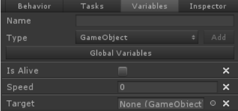
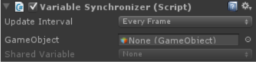
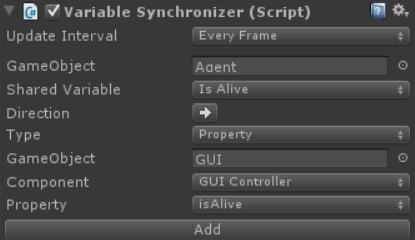
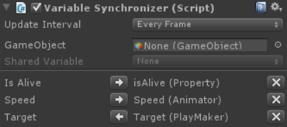

# 변수 싱크로나이저(Variable Synchronizer)

공유 변수는 태스크 및 비헤이비어 트리에서 데이터를 공유하는 데 유용합니다. 그러나 어떤 경우에는 비-비헤이비어트리 컴포넌트(Non-behavior tree component)와 동일한 변수를 공유하려고 할 수 있습니다. 예를 들어 GUI를 관리하는 GUI 컨트롤러 컴포넌트가 있을 수 있습니다. 이 GUI 컨트롤러는 비헤이비어 트리에 의해 제어되는 에이전트가 활성 상태인지 여부를 나타내는 GUI 요소를 표시합니다. 에이전트가 살아있는지 여부를 나타내는 bool을 사용하여 이를 수행합니다.

```csharp
public bool isAlive { get; set; }
```

변수 싱크로나이저(Variable Synchronizer) 컴포넌트를 사용하면 이 bool 값과 해당 공유 변수를 서로 동기화된 상태를 자동으로 유지할 수 있습니다.

변수 싱크로나이저를 설정하려면 먼저 동기화하려는 공유변수를 생성했는지 확인해야 합니다. 이 예시에서는 세 개의 공유 변수를 만들었습니다:



그 다음에는 `Beharivor Designer/Varable Synchronizer` 컴포넌트를 게임 오브젝트에 추가합니다.



다음으로 동기화를 유지하려는 공유 변수를 추가합니다. 이 예시에서는 이전에 언급한 Is Alive 변수를 추가하겠습니다.



1. 동기화 하려는 공유 변수가 있는 비헤이비어 트리가 포함된 게임 오브젝트를 지정합니다.
2. 팝업 상자에서 사용하려는 공유 변수를 선택합니다.
3. 방향을 지정합니다. 화살표가 왼쪽을 가리키면 공유 변수 값을 설정하는 것이고 화살표가 오른쪽을 가리키고 있으면 공유 변수 값을 가져오는 것입니다.
4. 동기화 타입을 지정합니다. 현재 지원되는 타입은 Behavior Designer, Property, Animator, PlayMaker 입니다.
5. 나머지 단계는 선택한 동기화 타입에 따라 다릅니다. 이 예제에서는 Property가 선택되었으므로 공유 변수와 동기화하려는 속성이 포함된 컴포넌트를 선택해야 합니다.
6. Add 버튼을 클릭합니다.

Is Alive 공유 변수가 추가되면 Update Interval로 지정된 간격으로 isAlive 프로퍼티가 설정됩니다. 다음 스크린샷에는 동기화된 변수가 몇 개 더 포함되어 있습니다:



- Is Alive 공유 변수가 isAlive 프로퍼티를 설정하고 있습니다.
- Speed 공유 변수는 Speed Animator 매개변수를 설정하고 있습니다.
- Target 공유변수는 Target PlayMaker 변수의 값을 가져와서 설정되고 있습니다.