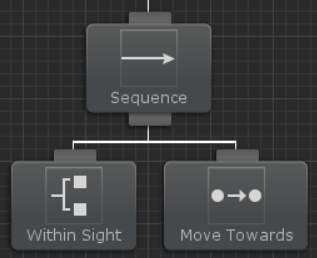

# 변수(Variables)

비헤이비어 트리의 장점 중 하나는 모든 태스크가 느슨하게 연결되어 있어서 매우 유연하다는 점입니다. 즉, 하나의 태스크가 작동하는 다른 태스크에 의존하지 않는다는 의미입니다. 이러한 유연성에서 발생하는 단점으로 가끔 태스크 사이에서 정보를 공유하는 태스크가 필요하다는 것입니다. 예를 들어, 목표물이 시야 내에 있는지 확인하는 Within Sight 태스크와 목표물이 시야 내에 있는 경우 목표물을 향해 이동하는 Move Towards 태스크가 있을 때, Within Sight 태스크가 찾아낸 대상을 방향으로 Move Towards 태스크에서 이동시켜야 하므로 이 두 태스크는 목표 대상에 대한 정보 공유가 필요합니다. 전통적인 비헤이비어 트리에서는 이것을 블랙보드(Blackboard)를 구현하여 해결했습니다. 비헤이비어 디자이너는 변수를 사용할 수 있다는 점에서 훨씬 쉽게 필요한 정보를 공유할 수 있습니다.

앞의 예시에서 우리는 두 가지 태스크를 보았습니다. 하나는 목표물이 시야 내에 있는지 확인하고, 다른 하나는 목표물을 향해 이동했습니다. 이 트리는 다음과 같습니다:



이 두 태스크에 대한 코드는 [새 태스크 작성](https://opsive.com/support/documentation/behavior-designer/writing-a-new-conditional-task/) 항목에서 이야기했지만 변수를 다루는 부분은 이 변수 항목에 있습니다:

```csharp
public SharedTransform target;
```

`SharedTransform` 변수가 생성되면 이제 비헤이비어 디자이너 내에서 새 변수를 생성하고 해당 변수를 두 태스크에 할당할 수 있습니다:


태스크 관리자로 전환하고 해당 변수를 두 태스크에 할당합니다.


그리고 이를 통해 두 태스크가 정보 공유를 시작할 수 있습니다. Value 프로퍼티에 접근하여 공유 변수의 값을 얻거나 설정(get/set)할 수 있습니다. 예를 들어 `target.Value`는 트랜스폼 객체를 반환합니다. `Within Sight`가 실행되면 시야에 들어오는 오브젝트의 트랜스폼을 `target` 변수에 할당합니다. `Move Toward`가 실행되면 해당 `target` 변수를 사용하여 이동할 위치를 결정합니다.

인스펙터 내에서 변수의 삭제 버튼 왼쪽을 보면 오른쪽을 가리키는 삼각형을 볼 수 있습니다. 이것은 변수 매핑을 위한 버튼입니다.


변수 매핑을 사용하면 SharedVariable을 동일한 타입의 프로퍼티에 매핑할 수 있습니다. 이를 통해 모노비헤이비어 컴포넌트의 값을 빠르게 가져오거나 설정할 수 있습니다. 예를 들어 에이전트의 위치를 얻고 싶다고 가정 해봅시다. 매핑되지 않은 변수와 함께 Get Position 태스크를 사용할 수 있지만 이 방법은 비헤이비어 트리에 불필요한 태스크를 추가합니다. 대신 Transform.position 프로퍼티에 변수를 매핑하면 변수 값에 액세스할 때마다 매핑된 프로퍼티가 대신 사용됩니다. 이를 통해 추가 태스크없이 Transform의 위치를 가져오거나 설정할 수 있습니다.

> **Note** : 변수 매핑에는 C# 프로퍼티가 필요합니다. C# 필드에서는 동작하지 않습니다. 위의 Vector3 예제에서는 다음을 사용하여 프로퍼티 매핑을 설정할 수 있습니다:

```csharp
public class MyMonoBehaviour : MonoBehaviour
{
   private Vector3 m_MyVector3;
   public Vector3 MyVector3 
   { 
      get { return m_MyVector3; } 
      set { m_MyVector3 = value; } 
   } // 프로퍼티 매핑에 필요합니다.
}
```

비헤이비어 디자이너는 지역 변수와 전역 변수를 모두 지원합니다. [전역 변수](https://opsive.com/support/documentation/behavior-designer/variables/global-variables/)는 모든 트리가 동일한 변수를 참조할 수 있다는 점을 제외하면 지역 변수와 유사합니다. 비헤이비어 트리에서 변수에 대한 [참조를 가져옴](https://opsive.com/support/documentation/behavior-designer/variables/accessing-variables-from-non-task-objects/)으로써 비-태스크(Non-task) 파생 클래스에서 변수를 참조할 수 있습니다.

기본 비헤이비어 디자이너 설치에는 다음과 같은 공유 변수 타입이 포함됩니다. 이러한 타입 중에 어느 것도 상황에 적합하지 않은 경우 고유한 [공유 변수를 만들 수 있습니다](https://opsive.com/support/documentation/behavior-designer/variables/creating-shared-variables/):

- SharedAnimationCurve
- SharedBool
- SharedColor
- SharedFloat
- SharedGameObject
- SharedGameObjectList
- SharedInt
- SharedMaterial
- SharedObject
- SharedObjectList
- SharedQuaternion
- SharedRect
- SharedString
- SharedTransform
- SharedTransformList
- SharedVector2
- SharedVector3Int
- SharedVector3
- SharedVector3Int
- SharedVector4

## 동적 변수(Dynamic Variables)

동적 변수를 사용하면 범위가 제한된 임시 변수를 사용할 수 있습니다. 이러한 변수는 제한된 수의 태스크 사이에 데이터를 공유하고 해당 태스크 외부에서 변수에 액세스할 필요가 없는 경우에 유용합니다. 동적 변수는 변수 필드 오른쪽에 있는 원을 클릭한 다음 "(Dynamic)"을 선택하여 생성할 수 있습니다:


동적 변수가 생성된 후 변수의 이름을 입력할 수 있습니다.


변수 이름을 입력하고 나면 이 동적 변수를 트리 내에서 사용할 수 있게 됩니다. 동적 변수는 동일한 동적 변수 이름을 참조하는 모든 필드에 대해 동일한 값을 갖게 됩니다. 이름은 대소문자를 구분하며 트리 내의 지역 변수와 동일하지 않아야 합니다.

## 전역 변수(Global Variables)

전역 변수는 모든 비헤이비어 트리가 동일한 변수의 인스턴스에 액세스 할 수 있다는 점을 제외하고는 지역 변수와 유사합니다. 전역 변수에 액세스하려면 [Window > Behavior Designer > Global Variables] 메뉴 옵션을 선택하거나 변수 패널에서 다음을 수행합니다:


전역 변수가 처음 추가되면 모든 전역 변수를 저장하는 에셋 파일이 생성됩니다. 이 파일은 `/Behavior Designer/Resources/BehaviorDesignerGlobalVariables.asset`에서 생성됩니다. 이 파일이 `Resources` 폴더에 들어있기만 하면 어디로든지 이동시킬 수 있습니다.

전역 변수는 지역 변수와 매우 유사한 방식으로 할당됩니다. 태스크 인스펙터에서는 "Globals" 메뉴 항목 아래에서 할당할 수 있습니다.


전역 변수는 [비-태스크(Non-task) 오브젝트에서도 액세스](https://opsive.com/support/documentation/behavior-designer/variables/accessing-variables-from-non-task-objects/)할 수 있습니다.

## 공유 변수 생성(Creating Shared Variables)

빌트인 타입을 사용하지 않으려면 새 공유 변수를 생성할 수 있습니다. 공유 변수를 생성하려면 `SharedVariable` 타입을 서브클래싱하고 다음 메서드를 구현합니다. 키워드 `OBJECT_TYPE`은 생성하려는 공유 변수의 타입으로 대체되어야 합니다.

```csharp
[System.Serializable]
public class SharedOBJECT_TYPE : SharedVariable<OBJECT_TYPE>
{
   public static implicit operator SharedOBJECT_TYPE(OBJECT_TYPE value) 
   { 
      return new SharedOBJECT_TYPE { Value = value }; 
   }
}
```

`Value` 프로퍼티가 존재하는 것이 중요합니다. 새 공유 변수가 잘못 생성되면 변수 인스펙터에 오류가 표시됩니다. 공유 변수는 프리미티브, 배열, 리스트, 사용자 정의 오브젝트 등을 포함하여 태스크에 포함될 수 있는 모든 타입의 오브젝트를 포함합니다.

예를 들어 다음 스크립트를 사용하면 사용자 정의 클래스를 공유할 수 있습니다:

```csharp
[System.Serializable]
public class CustomClass
{
    public int myInt;
    public Object myObject;
}

[System.Serializable]
public class SharedCustomClass : SharedVariable<CustomClass>
{
    public static implicit operator SharedCustomClass(CustomClassvalue) 
    {
        return new SharedCustomClass { Value = value }; 
    }
}
```

## 태스크가 아닌 오브젝트로부터 변수에 접근하기

변수는 일반적으로 비헤이비어 디자이너 인스펙터 패널 내의 태스크 필드에 변수 이름을 [할당](https://opsive.com/support/documentation/behavior-designer/variables/)하여 참조됩니다. 지역 변수는 다음 메서드를 호출하여 비-태스크 파생 클래스(예:MonoBehaviour)에서도 액세스할 수 있습니다.

```csharp
behaviorTree.GetVariable("MyVariable");
behaviorTree.SetVariable("MyVariable", value);
behaviorTree.SetVariableValue("MyVariableName", value);
```

변수를 설정할 때 태스크가 해당 변수를 자동으로 참조하도록 하려면 미리 해당 이름으로 변수가 생성되었는지 확인하십시오. 다음 코드 스니펙은 `MonoBehaviour` 클래스에서 변수를 수정하는 예를 보여줍니다:

```csharp
using UnityEngine;
using BehaviorDesigner.Runtime;

public class AccessVariable : MonoBehaviour
{
   public BehaviorTree behaviorTree;

   public void Start()
   {
      var myIntVariable = (SharedInt)behaviorTree.GetVariable("MyVariable");
      myIntVariable.Value = 42;
   }
}
```

위의 예시에서는 비헤이비어 디자이너 변수 창 내에서 `MyVariable`이라는 변수에 대한 참조를 얻습니다. 또한 예제와 같이 `SharedVariable.Value` 프로퍼티를 사용하여 변수의 값을 가져오고 설정할 수 있습니다.

마찬가지로 `GlobalVariable` 인스턴스에 대한 참조를 가져와 전역 변수에 액세스 할 수 있습니다.

```csharp
GlobalVariables.Instance.GetVariable("MyVariable");
GlobalVariables.Instance.SetVariable("MyVariable", value);
```