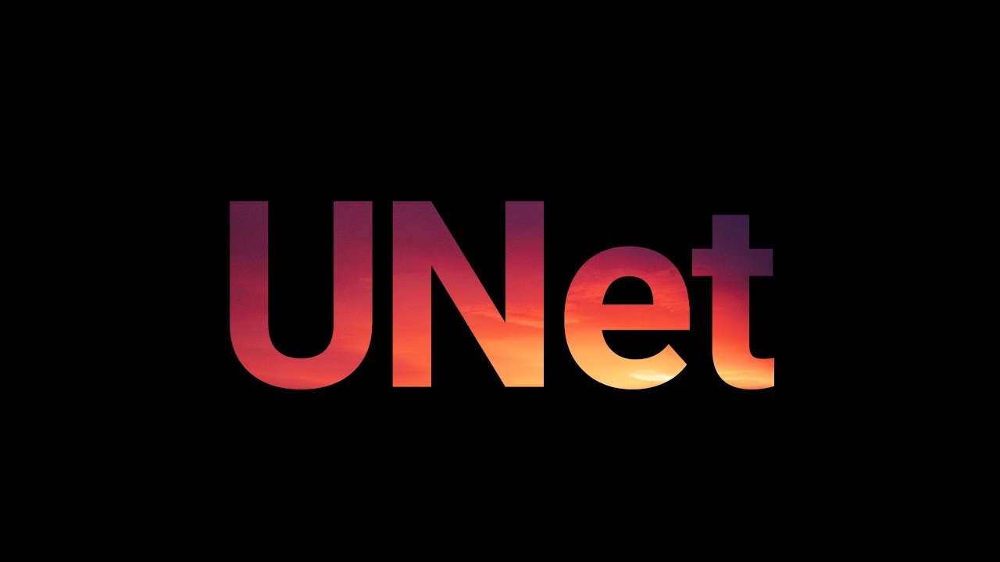
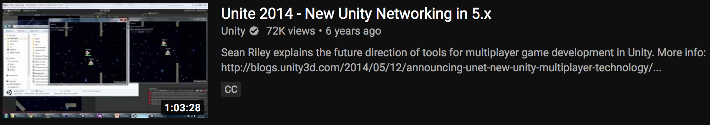
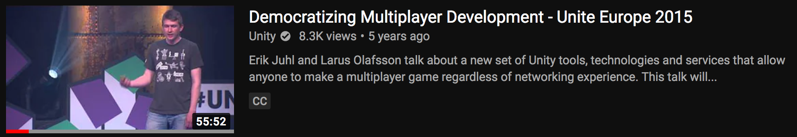
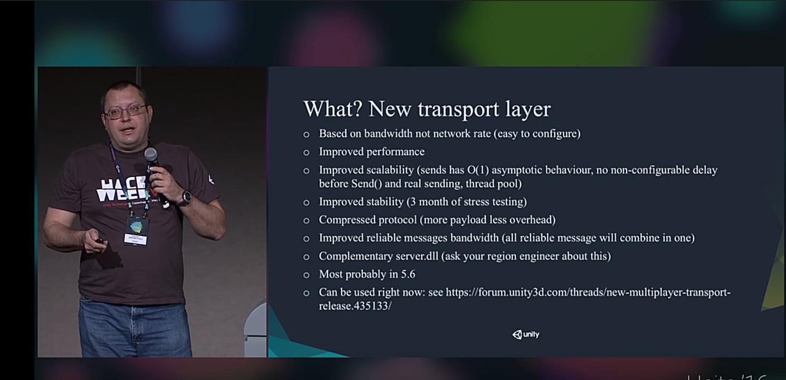
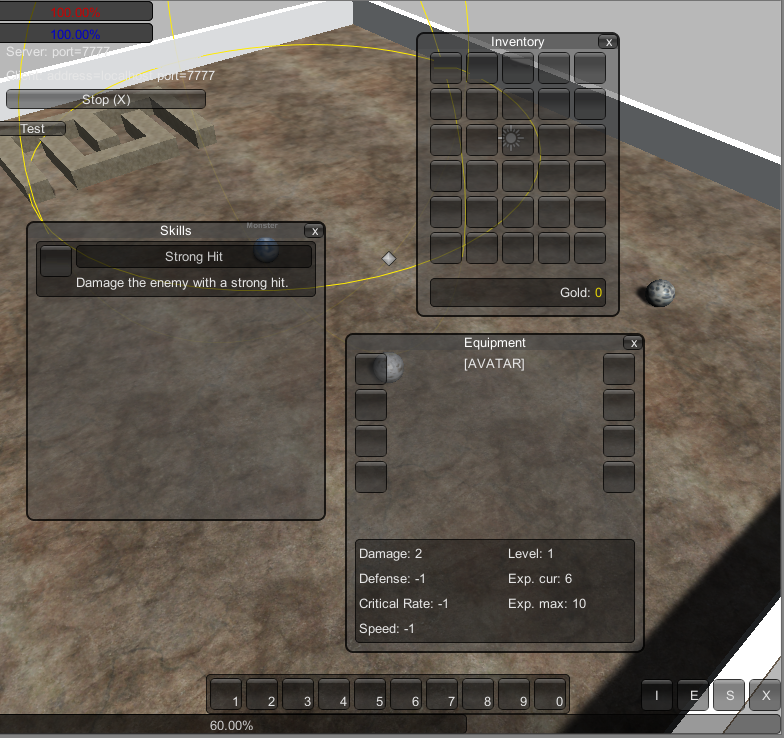
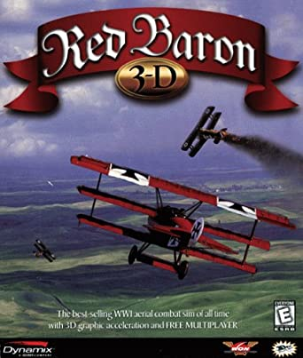
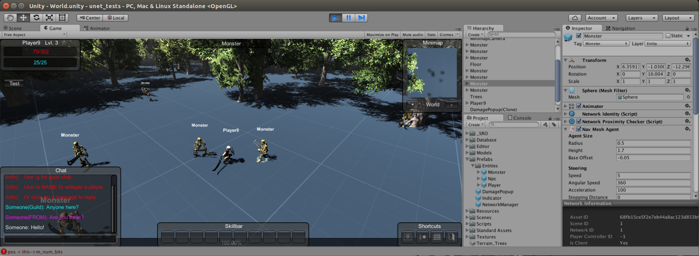
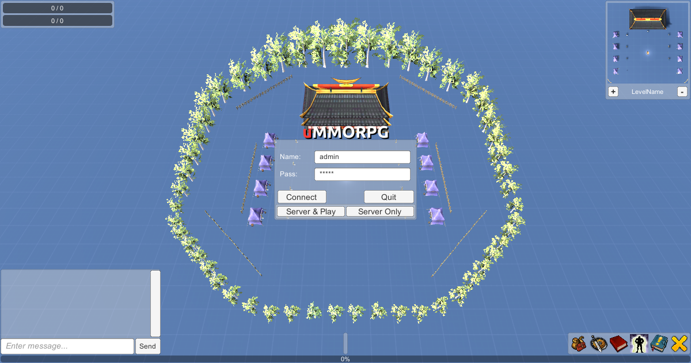

# 미러의 간략한 역사

> 미러가 존재하는 이유와 여기까지 온 방법에 대한 간략한 개요 - by vis2k

우리의 커뮤니티는 많이 성장해왔습니다. 이 모든 것이 시작되었을 때 대부분의 사람들이 함께 하지는 않았기 때문에 여기서 UNET/Mirror의 간략한 역사에 대해서 이야기 하겠습니다.

Mirror가 처음이라면 재미있게 읽으시기를 바랍니다. 아마도 이 시간동안 주변에 있었던 사람들을 위한 향수 가득한 스크린샷과 함께 추억의 길로 여행을 떠날 것입니다.

> 미러가 시간이 지나면서 발전함에 따라 이 글을 계속 업데이트 할 예정입니다.

## UNET

2015년 여름에 유니티는 **UNET** 공개 베타를 출시했습니다. 네트워킹에 대한 귀찮음이 우리 게임의 귀찮음을 유발한다는 유니티의 아이디어는 꽤나 매력적으로 들렸습니다. UNET에는 다음과 같은 몇 가지 흥미로운 기능이 있습니다:

- **서버와 클라이언트를 한 프로젝트에 넣습니다**. 대부분의 코드를 공유합니다. 일부는 [Server] 또는 [Client]로만 표시됩니다.
  - 터레인, 모델, 에셋 및 코드가 모두 서버와 클라이언트 사이에서 공유되므로 생산성을 크게 높일 수 있습니다. 
- 선택한 변수의 자동 직렬화를 위한 **[SyncVars]**
  - 이것은 손수 만든 Serialize/Deserialize 함수에서 빠져나오기 위한 좋은 방법이었습니다. 단순하게 Player.level 앞에 [SyncVar]를 추가하는 것으로 손쉽게 적용할 수 있습니다.
- **[Commands/Rpcs]** - [Command] 태그로 함수를 래핑하여 서버에서 자동으로 호출함으로써 생산성을 크게 향상시켰습니다.
  - 수동으로 메시지를 보내는 것과 비교하여 모든 매개변수를 역직렬화하고 수동으로 함수를 호출합니다.

## 과대 광고

2015년으로 돌아가보면 거의 매달 UNET과 관련된 토크와 [멀티플레이어 개발 민주화](https://www.youtube.com/watch?v=gZbbYXzyXKk)와 같은 비디오가 있었습니다. 모두가 신났고, UNET팀도 열심히 일하고 있었습니다.

당시에는 대부분 다음과 같이 여겨졌습니다:

- Alexey Abramychev: 낮은 수준의 Transport(LLAPI)에서 일한 친절한 러시아 사람
- Sean Riley: World of Warcraft에서 일했으며 현재 고급 API(HLAPI/UNET)를 개발 중입니다.
- Erik Juhl: MMO가 자신의 열정이라고 말한 UNET 팀 리더

UNET 팀은 로드맵에 대한 큰 계획을 가지고 있었습니다: 

- 릴레이/매칭과 같은 클라우드 서비스
- Unity 에디터에서 바로 호스팅하는 원클릭 게임 서버
- MMO 규모 네트워킹을 지원하는 시뮬레이션 서버
- 영역을 지정하면 인스턴스로 실행되는 UNET 'Phase 3'(자동화된 서버 인스턴스).

대부분의 멀티플레이어 게임은 모든 코드를 완성하는 것이 매우 어렵기 때문에 결코 빛을 보지 못합니다. UNET을 사용하면 이러한 문제가 해결될 것처럼 보였습니다. 이 계획대로라면 확실히 생산성은 향상될 것이었습니다.

## 시작되다

UNET은 2015년에 아직 베타 버전이었습니다. 문서는 많지 않았고 몇 가지 데모만 있었습니다. 그 중 하나는 네트워크를 통해 움직이는 두 개의 공이 있는 움직임 데모였습니다.

네트워크로 연결된 NavMeshAgent의 움직임, 스킬, 장비 및 인벤토리는 SyncList와 모든 [SyncVer]/[Rpc] 편의성 덕분에 쉽게 추가되었습니다.

UNET은 베타 기간 동안 그다지 안정적이지 않았지만, 생산성 향상은 엄청났고 멀티플레이어 게임 개발의 미래로 가는 분명한 길처럼 보였습니다.

## 데이먼을 만나다

9월 경에는 데이먼 슬라이와 이야기를 나누기 시작했습니다. 그는 1990년에 시에라에서 출시한 [레드 바론](https://store.steampowered.com/app/263940/Red_Baron_Pack/)을 제작한 사람입니다.

데이먼과 그의 새로운 팀인 매드 오터 게임즈는 내가 계획한 대로 자체 인디 MMO를 만들었습니다. 그들은 유니티를 사용하지 않았지만 다음 프로젝트에서 유니티를 고려했습니다. 우리는 MMO 기술, 그동안 배운 교훈에 대해서 많은 이야기를 나눴고 그들은 심지어 내 이름 없는 MMO 프로젝트에 대한 몇 가지 모델을 제안했습니다.

UNET 팀은 지칠 줄 모르고 네트워킹 작업을 하고 있었고, 매드 오터의 사람들은 살아있는 증거였기 때문에, 내 인디 MMO 아이디어는 실제로 한 번 거의 실현 가능한 것 처럼 보였습니다.

## 만약에...

2015년에는 내가 말할 수 있는 한 어떤 유형의 MMO 툴킷도 사용할 수 없었습니다. 리버스 엔지니어링 시절부터 Perfect World Entertainment가 &100,000 - $300,000에 MMO 엔진을 라이선스한 것을 기억하고 있습니다. 이것은 더 말할 필요도 없이 내가 가용가능한 예산을 벗어난 것이었습니다.

어쨌든 내 자신의 MMO 코드를 작업하고 있었기 때문에 이것을 에셋 스토어에 올려놓고 무슨 일이 일어나느지 지켜보는 것이 나을 거라고 생각했습니다. 아마도 한 달에 $50 정도 팔리고 매주 피자 한 판을 먹을 수 있을 것 같았습니다.

[uMMORPG](https://prf.hn/l/ojL5PAJ)는 2015년 12월 23일, 에셋 스토어에 출시되었습니다. 크리스마스 하루 전이었습니다.

결과적으로 많은 사람들이 같은 꿈을 꾸었지만 AAA 엔진을 라이센스할 만큼의 돈이 없었습니다.

uMMORPG는 순식간에 스토어의 탑 10 에셋 중 하나가 되었습니다.

지난 날, MMO 개발은 내 취미였고, 여가 시간에 일하는 것은 내 꿈이었습니다. 유니티 엔진, UNET 및 언청난 투자 덕분에 하룻밤 사이에 정규직이 되었습니다.