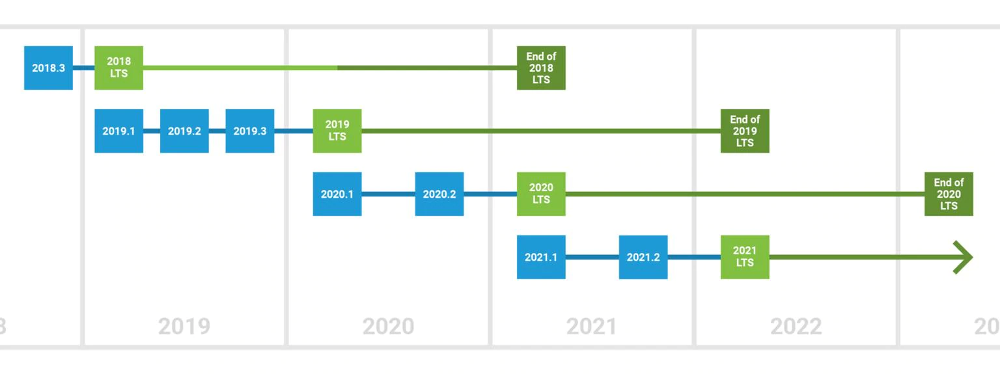

# 미러 네트워킹

> 우리가 만드므로 네트워킹에 대해 걱정하지 마십시오.   
> [우리는 게임을 출시](https://mirror-networking.com/showcase/)하고 향후 10년 동안 살아남을 수 있는 네트워킹 라이브러리가 필요했습니다.

[미러](https://prf.hn/l/EQZdA4V)는 유니티를 사용 편이성과 성공 가능성에 최적화된 유니티용 고급 네트워크 라이브러리입니다.

- 12개 이상의 저수준 [Transports](./user-manual/transports.md)와 호환됩니다.
- 학습 및 코딩을 더 쉽게 하기 위해 [스크립트 템플릿](./user-manual/general/script-templates.md) 라이브러리를 확장하고 있습니다.
- [속성(Attributes)](./user-manual/guides/attributes.md)을 통한 원격 프로시저 호출 및 컨텍스트 제어 기능이 있습니다.
- 12개 이상의 빌트인 [컴포넌트](./user-manual/components.md)가 있습니다.
- 다섯 가지 기본 기능을 가진 [관심 대상 관리](./user-manual/interest-management.md) 시스템이 있으며, 사용자 정의 버전의 관심 관리 기능을 만들 수 있습니다.
- 피직스 아이솔레이션(배틀 인스턴스, 레벨 등)이 있는 [Additive Scenes](./user-manual/examples.md)을 지원합니다.
- 몇 가지 완전한 [예제](./user-manual/examples.md)가 포함되어 있습니다.
- [매월](./user-manual/general/changelog.md) 지속적인 개선을 진행하고 있습니다.
- [디스코드](https://discord.gg/2BvnM4R)에서 풀타임 지원이 가능합니다.

---

## 유니티 버전

우리는 유니티 LTS 릴리즈 지원을 따릅니다. 그 이상의 모든 버전이 작동 가능하지만, 특히 프리뷰/베타 버전과 관련해서는 사용자가 스스로 결정해야 합니다.

현재는 유니티 2020 LTS를 사용할 것을 권장합니다.

