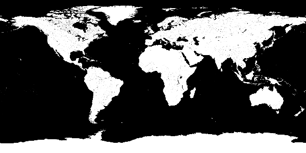
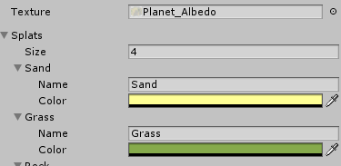
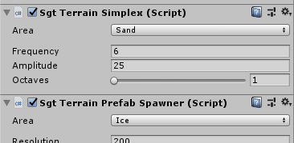

# 터레인(Terrain)

**터레인(Terrain)** 기능을 사용하면 카메라 거리에 따라 디테일이 증가하는 동적 표면 메시로 고해상도 행성을 렌더링할 수 있습니다. 이것은 큰 행성(예:지름 1km 이상)에 적합하며 지구만큼 큰 행성을 렌더링하는 데에도 사용할 수 있습니다. 행성이 너무 클 필요가 없거나 멀리서만 볼 경우에는 훨씬 간단한 **Planet** 기능의 **SgtPlanet** 컴포넌트를 사용하는 것이 좋습니다.

## 기본 설정

터레인 행성을 만드는 것으로 시작하십시오.

> **방법 1** - 하이어라키 탭을 마우스 오른쪽 버튼으로 클릭하고 **[Space Graphics Toolkit > Terrain Planet]**을 선택합니다.

> **방법 2** - 에디터의 상단 메뉴 바에서 **[GameObject > Space Grapihcs Toolkit > Terrain Planet]** 항목을 선택합니다.

> **방법 3** - 새 게임 오브젝트를 수동으로 만들고 **SgtTerrainPlanet** 및 **SgtTerrainPlanetMaterial** 컴포넌트를 추가합니다.

이제 장면에 **SgtTerrainPlanet** 및 **SgtTerrainPlanetMaterial** 컴포넌트가 선택된 게임 오브젝트가 포함되어야 합니다.

> **NOTE** - **SGT / Terrain Planet** 셰이더를 사용하는 머티리얼이어야 합니다. 예제 머티리얼 중 하나를 사용할 수 있습니다.

## Terrain Planet Shader

터레인 기능은 **SgtTerrainPlanet** 컴포넌트와 함께 사용하도록 특별히 설계된 **SGT / Terrain Planet** 셰이더와 함께 제공됩니다. 이 셰이더는 **SGT / Planet** 셰이더와 유사하게 동작하므로 먼저 해당 문서를 읽는 것이 좋습니다.

주요 차이점은 **DETAIL** 레이어에 더 이상 **Tiling**이 없다는 것입니다. 대신 **SgtTerrainPlanet** 컴포넌트의 **BakedDetailTilingA/B/C** 설정에서 타일링을 지정해야 합니다. 이것은 타일링을 터레인 메시에 베이킹하여 셰이더 설정만으로 가능한 것보다 훨씬 더 높은 해상도의 디테일 텍스처를 허용합니다.

### SHORE

해변을 표현하는 데 사용되는 옵션 모음입니다.

#### Mask (A)

주변의 해변이 표시되어야 하는 위치를 선택적으로 지정할 수 있습니다. 이 텍스처는 행성 표면의 albedo/normal/etc 텍스처의 매핑과 일치해야 합니다.

#### Albedo (RGB)

해변에 적용되는 알베도 디테일 텍스처를 지정할 수 있습니다.

#### Detail

디테일 텍스처를 적용할 디테일 레이어를 지정할 수 있습니다.

> **NOTE** - 이 설정의 타일링 계수는 **SgtTerrainPlanet** 컴포넌트의 **BakedDetailTilingA/B/C** 설정을 기반으로 합니다.

#### Range

해변이 나타날 수위 위의 월드 공간 높이를 지정할 수 있습니다.

#### Noise Tiling

기본 노이즈 타일링을 기준으로 디테일 타일링을 늘릴 수 있습니다.

> **NOTE** - 양의 정수여야 합니다.

## SGT Terrain Ocean Shader

터레인 기능은 바다를 렌더링하기 위해 **SgtTerrainOcean** 및 **SgtTerrainOceanMaterial** 컴포넌트와 함께 사용하도록 특별히 설계된 **SGT / Terrain Ocean** 셰이더와 함께 제공됩니다. 이 셰이더는 **SGT / Terrain Planet** 셰이더와 유사하게 작동하므로 먼저 실험해볼 것을 권장합니다.

> **NOTE** - 이 머티리얼은 일반 터레인에 사용되는 일반 **SgtTerrainPlanetMaterial** 컴포넌트가 아니라 **SgtTerrainPlanetOceanMaterial** 컴포넌트를 사용하여 렌더링해야 합니다.

> **NOTE** - 바다 렌더링이 작동하려면 카메라 깊이 텍스처가 필요합니다. 이것은 카메라에 **SgtDepthTextureMode** 컴포넌트를 추가하고 **DepthMode**를 **Depth** 또는 이와 유사한 것으로 설정해서 수행할 수 있습니다.

### DEPTH COLOR

깊이 색상을 지정하는데 사용되는 옵션의 모음입니다.

#### Range

바다 색상이 아래에서 지정한 색상에 도달하는 깊이를 지정할 수 있습니다.

#### Power

심해와 해안 색상 사이에 전환이 얼마나 선명한지를 제어할 수 있습니다.

#### Color

심해의 색상을 제어합니다.

### TRANSPARENCY

바다의 투명도를 설정하는 옵션들의 모음입니다.

#### Mode = Vertical

바다에 수면과 지표면 사이의 수직 깊이를 기반으로 투명도를 부여합니다.

#### Mode = Depth

카메라 깊이 텍스처와 지표면 사이의 거리에 따라 바다에 투명도를 부여합니다.

> **NOTE** - URP를 사용하는 경우 렌더링 파이프라인 에셋에서 **Depth** **Texture** 설정을 활성화해야 합니다.

#### Range

깊이에 따라 바다가 얼마나 빨리 폐색되는지 변경할 수 있습니다. 값이 높을수록 깊이가 상당히 낮아질 때까지 보기가 어려워집니다.

#### Depth Scale

깊이에 따라 바다가 얼마나 빨리 폐색되는지 변경할 수 있습니다. 값이 높을수록 깊이가 상당히 낮아질 때까지 보기가 어려워집니다.

#### Fresnel

얕은 각도에서 볼때 바다의 불투명도를 높일 수 있습니다. 큰 행성을 사용할 때 깊이 텍스처의 문제를 숨기는데 사용됩니다.

### REFRACTION

수면에 의한 굴절 효과를 위한 옵션 모음입니다.

#### Enabled

이 옵션을 활성화하면 수면을 통해 보이는 지형이 왜곡되는 굴절을 표현할 수 있습니다.

> **NOTE** - URP를 사용하는 경우 렌더링 파이프라인 에셋에서 **Opaque Texture** 설정을 활성화해야 합니다.

#### Strength

전체 굴절 왜곡 강도를 제어합니다.

### SHORE

해안을 표현하기 위한 옵션 모음입니다.

#### Fade Range

두 번째 레이어로 **TRANSPARENCY / Range** 설정과 유사하게 작동합니다. 이 옵션을 통해 해안선에서 급격한 전환을 피하기 위해 해안을 페이드할 수 있습니다.

#### Mask (A)

해안의 파도가 나타날 위치를 선택적으로 지정할 수 있습니다. 이 텍스처는 행성 표면의 albedo/normal/etc 텍스처 매핑과 일치해야 합니다.

### WAVES

행성의 해안선에 기본적인 애니메이션 파도 효과를 추가합니다.

#### Blend

파도 색상이 기본 바다 색상과 혼합되는 방식을 제어할 수 있습니다.

#### Opacity (A)

파도의 불투명 맵을 지정할 수 있습니다. 텍스처의 하단은 파도의 앞면이고 텍스처의 상단은 파도의 뒷면 입니다. 텍스터의 왼쪽은 파도가 깊은 물에 있을 때 사용되며, 텍스처의 오른쪽은 해안에 접근할 때 사용됩니다.

#### Color

파도의 전체 색상을 변경할 수 있습니다.

#### Range

파도가 나타날 수 있는 최대 로컬 공간 깊이를 설정할 수 있습니다.

#### Interval

파도 범위 내 파도의 양을 설정할 수 있습니다.

#### Speed

파도의 애니메이션 속도를 설정할 수 있습니다.

#### Noise Tiling

파도를 더 흥미롭게 보이도록 분해할 노이즈의 해상도를 설정할 수 있습니다.

## Heightmap

사전 설계된 전역 높이맵을 사용하여 지형을 변경하려면 **SgtTerrainHeightmap** 컴포넌트를 사용할 수 있습니다. 이것을 터레인 게임 오브젝트에 추가하고 **Heightmap** 설정을 원하는 높이맵 텍스처로 설정하기만 하면 됩니다.

이 높이맵 텍스처는 정방형(원통형) 투영을 사용해야 하며 픽셀의 0 값은 높이가 없음을 의미하고 255는 최대 높이를 의미합니다. **Displacement** 설정을 사용하여 전체 높이 배율을 제어할 수 있습니다.

## Atmosphere

행성에 **SgtAtmosphere** 컴포넌트를 사용하여 대기가 있는 경우, **SgtTerrainSharedMaterial** 컴포넌트로 터레인 위에 이를 렌더링할 수 있습니다. 이 컴포넌트를 터레인 게임 오브젝트에 추가하고 대기 게임 오브젝트를 **SgtTerrainSharedMaterial.SharedMaterial** 설정으로 끌어다 놓기만 하면 됩니다. **SgtAtmosphere** 컴포넌트는 동일한 게임 오브젝트에 **SgtSharedMaterial** 컴포넌트를 자동으로 생성하므로 머티리얼을 쉽게 공유할 수 있습니다. **SgtCorona**와 같은 다른 컴포넌트도 이 공유 머티리얼 시스템을 사용합니다.

## Procedural Heights

행성 높이를 절차적으로 생성하거나 높이맵을 보강하려는 경우 **SgtTerrainSimplex** 컴포넌트를 터레인 게임 오브젝트에 추가할 수 있습니다. 그런 다음 **Amlitude**와 같은 설정을 조정하여 최종 모양을 제어할 수 있습니다.

## Surface Colliders

터레인에 콜라이더를 추가하려면 터레인 게임 오브젝트에 **SgtTerrainCollider** 컴포넌트를 추가할 수 있습니다. 이 컴포넌트는 카메라 거리에 따라 행성 표면에 **MeshColliders**를 자동으로 생성합니다. **Resolution** 설정을 사용하여 이러한 콜라이더의 크기를 제어할 수 있습니다. 여기서 값이 높을수록 콜라이더가 작아집니다. **Detail** 설정을 사용하여 이러한 콜라이더의 삼각형 수를 제어할 수 있으며 **Radius** 설정을 사용하여 카메라 주변에 생성되는 콜라이더의 수를 제어할 수 있습니다.

## Procedual Prefab Spawning

터레인에 프리팹을 추가하려면 **SgtTerrainPrefabSpawner** 컴포넌트를 터레인 게임 오브젝트에 추가할 수 있습니다. 이것은 카메라가 접근함에 따라 터레인 표면에 절차적으로 프리팹을 생성합니다. 이러한 프리팹은 **Resolution** 설정을 지반으로 하는 크기의 그룹으로 생성됩니다. 생성된 그룹의 수는 **Radius** 설정에 따라 다르며 **Limit** 설정으로 그룹당 생성할 수 있는 프리팹의 수를 제어할 수 있습니다.

## Areas

Areas 기능을 사용하면 절차적 높이(Procedual Heights)와 프리팹을 터레인에 표시할 위치를 지정할 수 있습니다. 자신만의 에셋을 만들려면 **Features/Terrain/Media/Terrain Areas** 예제 에셋을 복제하면 됩니다. 이 세셋을 사용하면 특정 영역 이름과 연관시키려너ㅡㄴ 텍스처와 그 안의 색상 목록을 지정할 수 있습니다.

생성되면 이 에셋을 **SgtTerrain** 컴포넌트의 **Areas** 설정으로 끌어다 놓을 수 있습니다. 이제 절차 높이와 프리팹이 생성되는 영역을 지정할 수 있습니다.

## Optimization

터레인 메시 생성의 성능은 생성된 삼각형의 수화 카메라가 움직이는 속도에 따라 다릅니다.

기본 삼각형 수는 **SgtTerrainPlanet** 컴포넌트의 **Resolution** 설정을 사용하여 제어됩니다.

카메라가 지형에 접근하면 메시의 디테일이 증가합니다. 이 메시는 가메라 거리가 반으로 줄어들 때마다 디테일이 두 배가 되며, 반할 수 있는 최대 시간은 **Radius** 및 **Smallest Triangle** **Size** 설정에 따라 다릅니다.

각 LOD 단계에 대해 생성되는 삼각형의 양은 **Detail** 설정을 사용하여 제어합니다. 디테일 설정 1은 데스크탑 장치의 좋은 시작점입니다. 고성능 장치의 경우 2와 같은 높은 값을 사용하거나 모바일 및 기타 저사양 장치의 경우 0.5와 같은 낮은 값을 사용할 수 있습니다.

마지막으로 성능은 카메라 속도의 영향도 받을 수 있습니다. 카메라가 삼각형 거리를 두 개 이상 이동할 때마다 지형 메시가 업데이트됩니다. 카메라 속도를 터레인 표면에 접근할 때와 동일하게 유지하면 프레임마다 점점 더 많은 삼각형이 생성되어 성능이 저하될 수 있습니다. 이를 완화하려면 카메라가 표면에 접근할 때 프레임마다 일정한 양의 삼각형이 생성되도록 하는 것이 좋습니다.