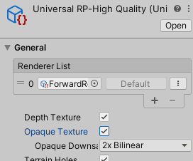

# URP/HDRP가 지원되나요?

Space Graphics Toolkit은 3가지 렌더 파이프라인(Standard, URP, HDRP)을 모두 지원하며 현재 프로젝트 설정을 자동으로 갑지하고 유사하게 보이도록 씬에 필요한 수정을 수행합니다.

그러나 각 파이프라인은 해당 작업을 약간 다르게 처리하며 문서의 이 섹션에서는 알아야 할 사항에 대해 자세히 설명합니다.

## Better Shaders

이 호환성은 [Better Shaders](http://carloswilkes.com/Get/BetterShaders) 시스템을 사용하여 가능했습니다(필수 에셋 아님).

Better Shaders 에셋은 미리 각 셰이더의 여러 변형을 생성하므로 이 에셋이 없더라도 SGT와 완전한 렌더 파이프라인 호환성을 계속 유지할 수 있습니다.

BetterShaders(따라서 SGT)는 현재 다음을 지원합니다.

- **Standard - SGT에서 지원하는 모든 버전**0

- **URP - Unity 2019 LTS**

- **URP - Unity 2020.2 ~ 2021.1**

- **HDRP - Unity 2019 LTS**

- **HDRP - Unity 2020.2 ~ 2021.1**

이 에셋에서 최신 버전에 대한 지원이 표시됩니다.

## Lights

많은 SGT 컴포넌트(예:대기)는 자체 커스텀 라이팅을 구현합니다. 일반 유니티 라이팅을 이들과 호환되게 하려면 여기에 **SgtLight** 컴포넌트를 추가 해야합니다. 이 컴포넌트는 유니티 라이팅의 색상, 강도, 위치 등을 자동으로 읽어들입니다.

라이트는 각 렌더링 파이프라인에서 다르게 작동하므로 CwLightIntensity 컴포넌트가 모든 데모 씬에 추가되었습니다. 이 컴포넌트에는 각 파이프라인의 라이팅 강도를 재정의하는 기능이 있습니다. 예를 들어 **IntensityInURP** 설정이 100으로 설정된 경우 프로젝트에서 URP를 사용하면 라이트의 강도가 자동으로 100으로 변경됩니다.

> **NOTE** - 프로젝트가 하나의 특정 렌더링 파이프라인을 대상으로 하는 경우 이 컴포넌트는 사용하지 않아도 됩니다.

## Depth Mode (Standard)

SGT의 일부 기능(예:Terrain Ocean과 Softness)을 제대로 렌더링하려면 장면 깊이 정보(scene depth information)가 필요합니다. 기본적으로 카메라는 이를 생성하지 않으므로 수동으로 CwDepthTextureMode 컴포넌트를 카메라에 추가하고 DepthMode 설정을 Depth 또는 DepthNormals로 설정해야 합니다.

## Depth Texture & Opaque Texture (URP)

SgtBlackHole 및 Terrain Ocean 셰이더와 같은 SGT의 일부 기능에는 장면 깊이(scene depth) 및 장면 색상 정보(scene color information)가 필요합니다. 기본적으로 이들을 URP에서 생성되지 않으므로 파이프라인 설정 에셋에서 깊이 텍스처(Depth Texture) 및/또는 불투명 텍스처(Opaque Texture) 설정을 활성화해야 합니다.

## Volume (HDRP)

원활한 HDRP 호환성을 위해 각 데모 씬에는 **SgtDemo** 컴포넌트가 있는 **Demo** 게임 오브젝트가 포함되어 있습니다. 이 컴포넌트는 HDRP에 **Volume** 컴포넌트를 추가합니다.

이 볼륨은 장면 노출(scene exposure)을 조정하고 시각적 환경을 비활화하며, 안개를 비활성화 합니다. 이 모든 작업은 장면이 다른 렌더링 파이프라인과 일치하게 보이도록 하기 위해 수행됩니다. 이러한 설정을 직접 조정하려면 이 컴포넌트를 삭제하고 볼륨 설정을 직접 조정하거나 이 게임 오브젝트를 삭제하고 고유한 볼륨을 생성할 수 있습니다.

## Atmosphere Scattering (Standard (HDR) + URP (HDR) + HDRP)

카메라가 HDR 렌더링을 사용하고 씬이 대기 산란(atmosphere scattering)을 사용하는 경우, Atmosphere 머티리얼의 LIGHTING SCATTERING HDR 설정을 활성화해야 합니다. 이것은 표준 0..1(0..255) 색상 범위를 초과할 수 있는  계산을 수행하도록 대기 산란 셰이더를 수정하여 HDR 렌더리에 적합하게 만듭니다.

> **NOTE** - 이 설정은 모든 예제 씬에서 비활성화 되어 있으므로 원하는 경우 수동으로 활성화해야 합니다.

> **NOTE** - 이 설정은 항상 HDR을 사용하는 HDRP에서 자동으로 활성화됩니다.

## Atmosphere Brightness (HDRP)

모든 SGT 데모 씬은 Standard 및 URP 렌더링 파이프라인에서 가장 잘 보이도록 설계되었습니다. HDRP에서는 대기 렌더링이 예상보다 밝게 나타날 수 있습니다. 이 문제는 **SgtAtmosphere** 컴포넌트의 Brightness 설정을 0.6으로 줄이면 다른 파이프라인과 비슷하게 보입니다.

대기 산란 효과를 사용하려는 경우 atmosphere 머티리얼의 ScatteringStrength 설정에 0.5를 곱해주는 것처럼 업데이트할 수도 있습니다.

> **NOTE** - 위 내용들은 시작할 수 있는 값의 예시일 뿐이며, 정확한 값은 달성하려는 모양, 씬의 전체 밝기, 적용한 포스트 이펙트 등에 따라서 달라져야 합니다.

## Black Holes (URP)

URP에서 **SgtBlackHole** 컴포넌트는 블랙홀 주변 씬의 **OpaqueTexture**를 왜곡하여 작동합니다. 이름에서 알 수 있듯이 왜곡이 투명 개체를 표시하지는 않는다는 것을 의미합니다. 대부분의 예제 씬에서 배경 starfield는 투명하므로 나타나지 않습니다. 그것을들 나타나게 하고 여전히 투명하게 유지하려면 배경을 렌더링하는 데 사용된 backdrop/starfield 머티리얼을 찾고 **RenderQueue** 설정을 2001(Geometry + 1)로 변경해야 합니다. **중력파(Gravitational Wave)** 데모 씬의 시공 효과와 같이 블랙홀 왜곡에 나타나게 하려는 다른 투명 효과에 대해서도 동일한 작업을 수행할 수 있습니다.