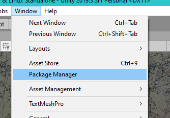
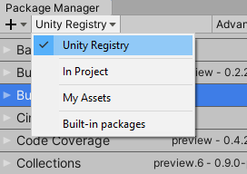

# 필수 패키지

> NOTE - Terrain 기능을 사용하려면 Space Graphics Toolkit에서 Burst 패키지를 수동으로 설치해야 합니다.

이 패키지를 설치하려면 먼저 Package Manager 창을 열고 패키지 목록 다운로드가 완료될 때까지 기다립니다.

드롭다운을 클릭하고 Unity Registry를 선택하면 유니티의 모든 공식 패키지를 볼 수 있습니다.

